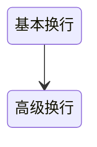

## 超出文本换行相关属性

### 问题
- word-break 与 white-space 的区别？
- 如何超出文本换行？
- 如何超出指定行以后再显示省略号？
- 什么是display:-webkit-box;

### 提炼

### 总结
- while-space和word-break区别？
  > white-space：作用于空格和回车，用于控制空格是否进行合并，回车是否进行换行，如果句子过长是否在空格处换行。
  > word-break：设置单词的换行方式，normal：默认换行，break-all：强制换行，keep-all：禁止换行。
- 基本换行
  > text-overflow: ellipsis; overflow: hidden; white-space: nowrap;word-break: break-all;
- 如何超出指定行以后再显示省略号？
  > -webkit-line-clamp: 2;display: -webkit-box;-webkit-box-orient: vertical;overflow: hidden;
- 什么是display:-webkit-box;
  > -webkit-box：是一种只兼容webkit内核的布局方式。
