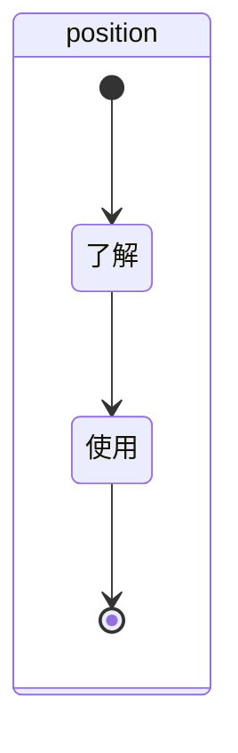

## position
### 分解
- absolute、fixed、relative相对于谁定位？
- position是什么？
- 为什么使用position？
- 子绝父相是什么？
- position都有哪些属性？
- sticky不生效的原因有什么？

### 抽象

### 总结
- position是用来定位元素的
- absolute、fixed、relative相对于谁定位？都有哪些属性？
  - absolute（绝对定位：相对于最近的已定位的祖先元素，如果没有祖先元素，则相对于body初始
  - fixed（固定定位：相对于浏览器窗口
  - relative（相对定位：相对于元素自身
  - sticky（粘性属性：相当于relative和fixed的结合
- 子绝父相：子级是绝对定位的话，父级就要是相对定位
- sticky不生效的原因有什么？
  - 父元素设置了overflow:hidden
  - sticky元素的top值没有设置
  - 父元素的高度不够