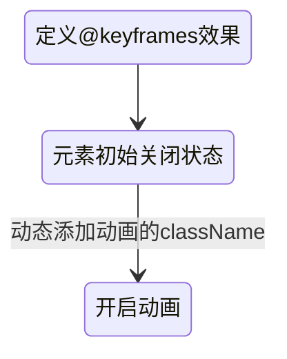

## 动画效果

### 灵感
- transition
- animation

### 流程
#### animation

```
@class-prefix-qa-detail: ~"geek-qa-detail";

.@{class-prefix-qa-detail} {
  @keyframes visible {
    0%{
      opacity: 0;
    }
    100%{
      opacity: 1;
    }
  }
  display: none;
  position: absolute;
  height: 87%;
  width: 100%;
  top: 0;

  &-visible{
    display: flex;
    animation-duration: .5s;
    /* 动画持续时间 */
    animation-name: visible;
    /* 动画名称 */
    animation-fill-mode: forwards;
    /* 动画结束后保持最后一帧的状态 */
    animation-timing-function: ease-in-out; /* 先慢后快的效果 */
  }

}
```