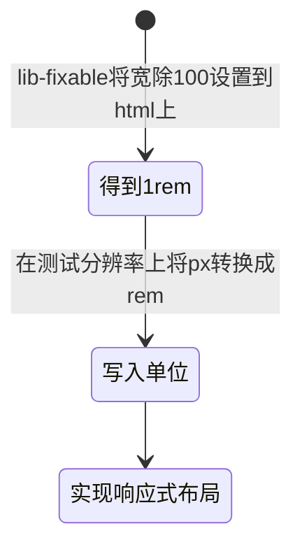

## 响应式布局相关

### 问题
+ 弹性布局是什么？
+ 弹性布局的应用场景是什么？
+ 实现弹性布局的主要单位？

### 相关难点
+ 如何在webpack打包中实现自动转pxToRem
+ 非webpack打包，手动pxToRem

### 解答
> 弹性布局是什么？  
- 网页内容要可以随显示设备的大小而动态调整布局

> 弹性布局的应用场景是什么？
- 移动端以及任何需要在不同设备精细化显示大小的场景。
  
> 实现弹性布局的主要单位？
- rem/em
  - rem：根据网页根元素`<html>`元素上设置的font-size进行计算
  - em：根据父元素的font-size进行计算
- rpx
  - 将屏幕等分750分，1rpx=屏幕宽度(350px)/750=0.5px
- vh/vw
  - vh：视口高度的1%
  - vw：视口宽度的1%
- %(不推荐使用，相对方式不同尺寸不同)
  - 根据最近元素的height/width进行适配
  - 不明确的父级单位高度的%无效(min-height:100%)，宽度正常
  - margin/padding相对于父级width定位
  - left/right相对于宽度、top/bottom相对于高度

> 在webpack中配置pxToRem
1. 安装postcss-pxtorem lib-flexible
2. 在webpack>module>rules>use中配置postcss-loader(这里有多种方式，可自行百度)
3. 主文件引入lib-flexible
4. 主目录写入postcss.config.js
5. 写入配置：注意有些webpack本地打包不生效
    ```js
    const PxToRem=require("postcss-pxtorem")
    module.exports={
        plugins:[
            PxToRem({
                rootValue:16,
                propList:["*"],
                ...剩余属性参考官网配置
            })
        ]
    }
    ```

> 手动转换rem单位
1. 引入lib-flexible
2. 下载vscode插件,px to rem...
3. 配置vscode基准参数

> 原理
