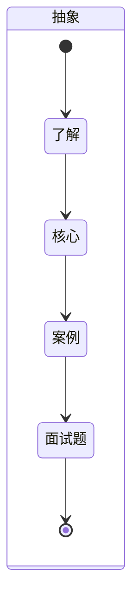

# flex布局
## 从哪里开始？

### MindMap

- flex是什么？
- flex的核心是什么？
- flex工作中最常见应用？
- flex实现一些特殊的样式？面试题？
- flex和grid布局各自的优点和缺点？

### StateDiagram

### Flowchart

- flex是什么？
  - flex布局又称弹性布局，使用flex可以让不同的设备适配不同的宽度。
- flex的核心是什么？
  1. 弹性容器（flex container）：采用flex的外层容器。
  2. 弹性项（flex item）：容器中的子元素。
  3. 主轴（main axis）：弹性容器的水平或者垂直方向。
  4. 交叉轴（cross axis）：与主轴垂直的方向。
  5. 对齐方式（align）：设置弹性项目在弹性容器中的对其方式。
- flex工作中最常见应用？
  - 弹性容器：
    1. flex-direction：主轴方向
    2. flex-wrap：弹性项是否换行
    3. justify-content：主轴上的弹性项的对其方式
    4. align-item：交叉轴上单行的弹性项的对其方式
    5. align-content：交叉轴多行弹性项的对其方式
    6. flex-flow：flex-direction flex-wrap;简写
  - 弹性项：
    - flex-shrink：弹性元素超出容器以后的缩小比例
    - flex-grow：弹性元素在容器剩余宽度的放大比例
    - flex-basic：弹性元素占用容器的比例，百分比
    - flex: flex-grow flex-shring flex-basic;的简写
  - [测试](https://github.com/liquidGo/Abstract_Key_Processes/tree/master/src/other/Grid_Flex_Style_Layout)
- grid在工作中的常用属性？
  - [grid布局](./[⭐⭐⭐⭐⭐]-grid布局详解.md)
- flex和grid的各自优点
  - flex：布局比较灵活简单，但是九宫格布局如果最后是一个弹性元素，无法向左居中
  - grid：布局相比较flex稍微麻烦一点，但是可以实现的样式较多
- flex子容器加入border边框并且不换行：
  - box-sizing: border-box;
  - 