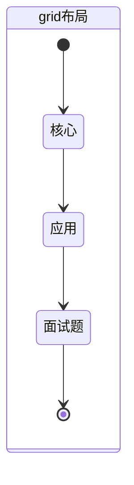
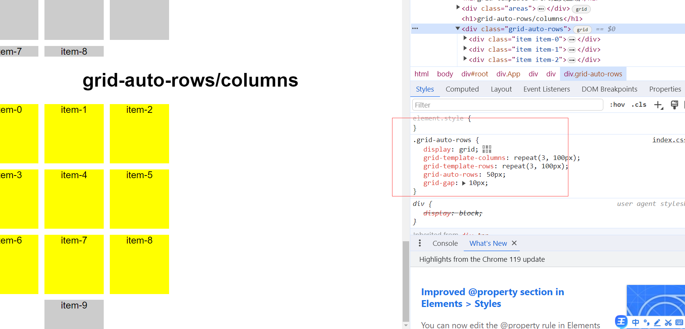
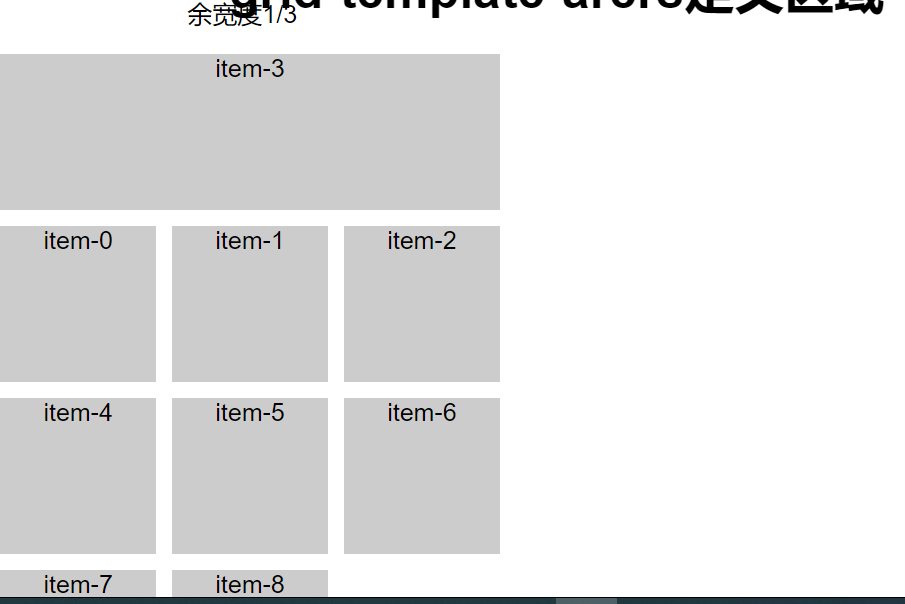
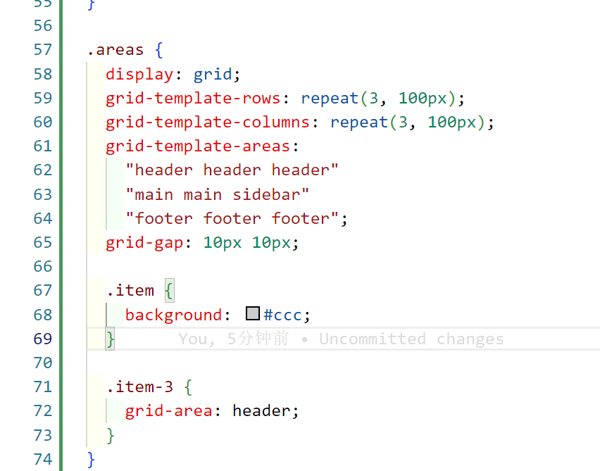
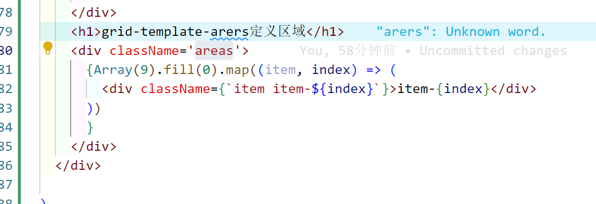

## Grid布局

### MindMap

- 什么是Grid布局？
- 与传统布局的不相同之处？
- 优点？缺点？
- 工作中的常用属性？
- 核心是什么？

### StateDiagram

### Flowchart

- Grid布局核心：
  - 容器（grid container）：采用Grid布局的父元素
  - 项目（grid item）：Grid布局的子项目
  - 轨道（grid track）：grid布局中的“行row”和“列column”
  - 网格线（grid line）：水平/垂直网格线为n+1
  - 单元格（grid cell）：grid系统的最小单元，行和列的交叉区域
  - 网格区域（grid area）：一个网格区域可以由任意数量的网格单元格组成

- Grid布局常用属性详解：

  - 关键字：
    - repeat(number,value)：重复value几次
    - auto-fill：根据容器宽度自适应number重复次数
    - fr：container剩余宽度/fr总份数
    - minmax(min,max)：当超出min宽度的时候，会自适应max的值
  - 容器（grid container）：
    - grid-template-columns/rows：设置列/行的数量以及宽度
    - grid-gap：row-gap column-gap;
    - grid-auto-flow：columns/rows;改变grid track的方向。
    - align：
      - justify-items/align-item：单元格的对其方式
      - place-items：<align-items> <justify-items>
      - justify-content/align-content：整个容器的对其方式
      - place-content：<align-content> <justify-content>
    - grid-auto-rows/column：设置超出单元格的元素的宽/高
      - 
    - grid-template-areas：设置网格区域，用areas设置区域定义class名称的样式
      - 

  - 项目（grid items）：
    - grid-/columns/rows-start/end：从哪条网格线开始，从哪条网格线结束。
    - justify-self/align-self/place-self：与上方相同
    - grid-area：配合grid-template-areas使用