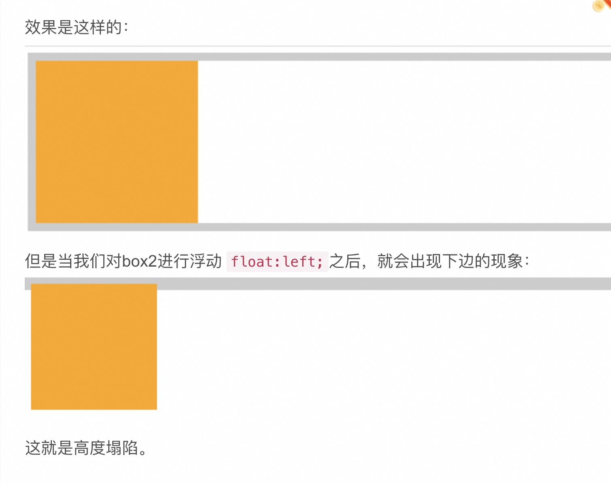

## 布局
### 灵感
- 常用的布局有哪些？
- 这些布局有哪些常用的api？
- 兼容性如何？
- 实现九宫格布局？
- Float布局有哪些缺点？
- 什么是文档流？

### 总结
- 常用的布局有哪些？
  > Flex、Float、Table、Grid

- 什么是文档流？什么是脱离文档流？
  > 文档流指在同一平面上，元素的从上到下从左到右的排列顺序。
  > 脱离文档流：影响了文档流元素的排列顺序，如：float、position、display...

- Float布局有哪些缺点？
  > 1. 影响文档流，会塌陷
    
  > 2. 垂直水平居中支持不友好

- Flex布局常用语法以及如何实现九宫格？[案例](https://github.com/liquidGo/Abstract_Key_Processes/blob/master/src/other/Grid_Flex_Style_Layout/index.tsx)
  - flex-direction、
  - flex-wrap、
  - flex-flow、
  - justify-content、
  - align-items、
  - align-content、
  - flex-grow（填满父元素剩余宽度，默认0不平均分剩余宽度）、
  - flex-shrink（子元素超出父元素时如何平分，默认1平均分）、
  - flex-basis（默认会取width当作flex-basis，如果手动设置了flex-basis高优先级）、
  - flex

  - flex是什么的缩写？
    > flex-grow、flex-shrink、flex-basis

- Grid布局以及九宫格的实现方法？[案例](https://github.com/liquidGo/Abstract_Key_Processes/blob/master/src/other/Grid_Flex_Style_Layout/index.tsx)
  - grid-template-columns（每列个数
  - grid-template-rows（每行个数
  - grid-column-start（开始列
  - grid-column-end（结束列
  - grid-row-start（开始行
  - grid-row-end（结束行
  - grid-area（grid-row-start / grid-column-start / grid-row-end / grid-column-end