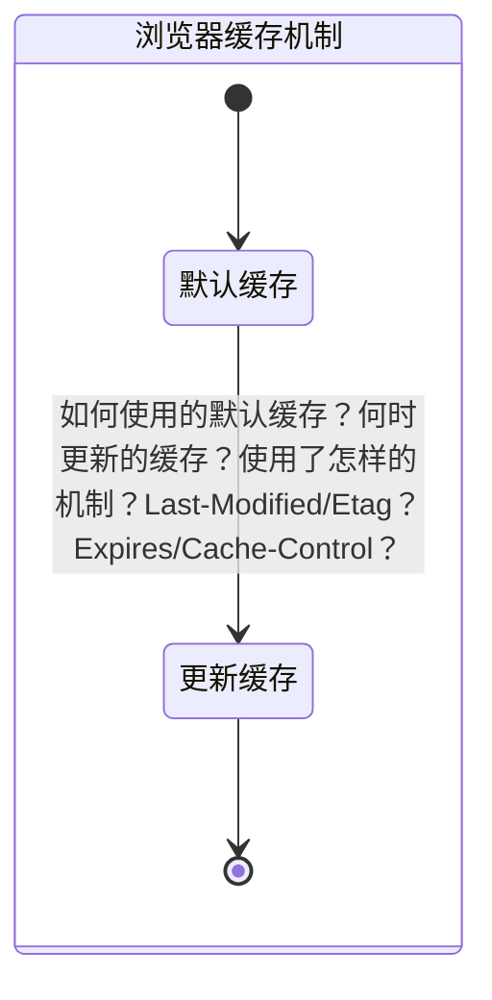

## 浏览器缓存机制

### MindMap

- 什么是强缓存？
- 什么是协商缓存？
- 如何判断强缓存还是协商缓存？
- 缓存机制起什么作用？

### StateDiagram

### Flowchart

#### 什么是强缓存/协商缓存？

首先需要了解下浏览器缓存的机制

> 当浏览器向服务器请求过一次数据以后，再次请求相同的数据的时候，不需要再次向服务器读取数据，直接从本地获取。
>
> 大大的减少了服务器的请求次数，更加高效。

#### Etag/Last-Modified、Expires/Cache-Control

> 浏览器缓存会根据响应头中的字段进行判断，如果不存在强缓存就使用协商缓存。

- 强缓存（Cache-Control>Expires 优先级）
  
  > 如果触发了强制缓存，就不会发起请求。失效了以后才会去跟服务器比较资源，使用协商缓存。
  
  - Expires：http1.0 的规范（在http1.1中已经被Cache-Control替换），返回一个绝对的 GMT 失效时间（较少使用，存在跨区的话可能会存在服务器时间不同，从而导致缓存不准确的问题，比较广泛使用的是 Cache-Control）
  - Cache-Control：http1.1 新增规范，通过设置 max-age 有效期进行缓存判断，除了 max-age 还有：
    - no-cache：不使用本地缓存。需要使用缓存协商，先与服务器确认返回的响应是否被更改，如果之前的响应中存在 ETag，那么请求的时候会与服务端验证，如果资源未被更改，则可以避免重新下载。
    - no-store：直接禁止游览器缓存数据，每次用户请求该资源，都会向服务器发送一个请求，每次都会下载完整的资源。
    - public：可以被所有的用户缓存，包括终端用户和 CDN 等中间代理服务器。
    - private：只能被终端用户的浏览器缓存，不允许 CDN 等中继缓存服务器对其缓存
- 协商缓存（Etag>Last-Modified）
  > 当强缓存失效的时候，才会去访问协商缓存  
  > 第一次请求 HTTP 返回 Last-Modified 和 Etag 两个字段，当第二次请求的时候会自动携带 if-Modified-Since/if-None-Match 两个字段对应 Last-Modified/Etag，依次校验，通过返回 304，失效返回 200 新 tag。
  - Etag：服务器返回静态资源的 token
  - Last-Modified：文件最后更新的时间戳。
  - [查看Etag/Last-Modified/Expires](../images/c4bf4ef821d8823a66df3a41fc9ca64ec980f939d6e81c307f3dad4edf4c524a.png)  

#### 总结流程图

