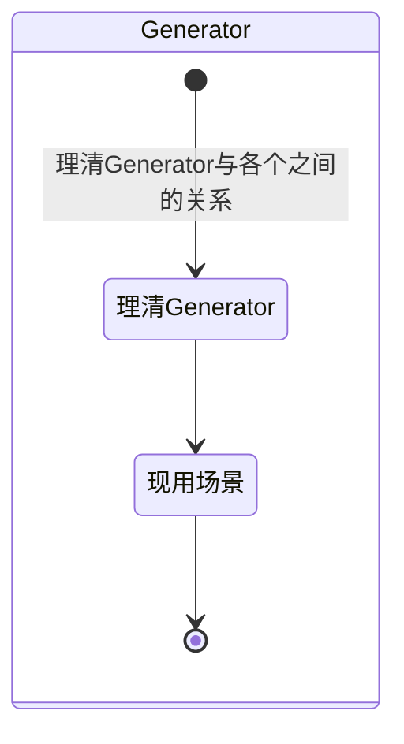
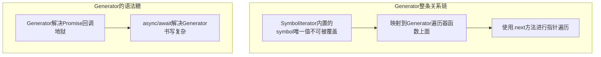

## ES6-Generator函数

### MindMap

- Generator和Iterator的关系是？
- Iterator和Symbol的关系是？
- Generator的使用方法是？
- Generator的语法糖是？
- Generator的现用场景？


### StateDiagram



### Flowchart

#### 理清Generator



#### 应用

- **async await是Generator的语法糖，比如ES6class构造器是ES5函数构造器的语法糖**

> 遍历器对象（iterator）：类似于数据库中的光标，遍历器对象有两个属性{done：boolean,value:any}

> 在Javascript中，一个函数一旦开始执行，就会运行到最后或遇到return时结束，运行期间不会有其它代码能够打断它，也不能从外部再传入值到函数体内。  

> **而Generator函数（生成器）的出现使得打破函数的完整运行成为了可能**，其语法行为与传统函数完全不同。  
> Generator函数是ES6提供的一种异步编程解决方案，形式上也是一个普通函数，但有几个显著的特征：

  1. function关键字与函数名之间有一个星号 “*” （推荐紧挨着function关键字）

  2. 函数体内使用 yield 表达式，定义不同的内部状态 （可以有多个yield）

  3. 直接调用 Generator函数并不会执行，也不会返回运行结果，而是返回一个遍历器对象（Iterator Object）  

  4. 依次调用遍历器对象的next方法，遍历 Generator函数内部的每一个状态

     ```js
     function* gen() {
         yield 'hello'
         yield 'world'
         return 'ending'
     }
     
     let it = gen()
     
     it.next()   // {value: "hello", done: false}
     it.next()   // {value: "world", done: false}
     it.next()   // {value: "ending", done: true}
     it.next()   // {value: undefined, done: true}
     ```


