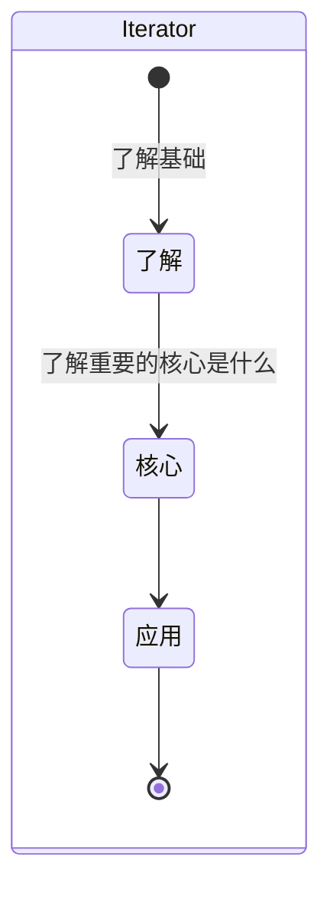

## Iterator

### MindMap

- 什么是Iterator迭代器？
- 有哪些数据结构拥有？
- 以哪些形式展现？
- 是否能实现一个简单的Iterator迭代器？
- Iterator这个概念源于哪里？


### StateDiagram



### Flowchart

#### 了解Iterator

> [迭代器](https://so.csdn.net/so/search?q=迭代器&spm=1001.2101.3001.7020)就是为实现对不同集合进行统一遍历操作的一种机制，只要给需要遍历的数据结构部署Iterator接口，通过调用该接口，或者使用消耗该接口的API实现遍历操作，类似于数据库的光标。

#### Iterator核心

- next方法：每使用一次就向下遍历一次
- 遍历器对象：{done:boolean,value:any}

#### 应用

- 实现一个Iterator

  - ```js
     var temp = creatIterator(['a','b','c']);
     console.log(temp.next());
     console.log(temp.next());
     console.log(temp.next());
     console.log(temp.next());
    
    function creatIterator(arr) {
        //由于要进行全局访问，长期保存变量值，因此此处用var
        //而不用let，var所具有的变量提升特性在这里是必要的
        var nextIndex = 0;
    
        return {
            next:function() {
                return nextIndex < arr.length?
                //如果索引变量小于当前传入数组的长度，则将对应的有效数据传出，并将遍历的状态标识done置为false
                {value:arr[nextIndex++],done:false}:
                //如果索引变量大于当前传入数组的长度，则传出无效undefined，并将遍历的状态标识done置为true
                {value:undefined,done:true};
            }
        };
    }
    ```

    