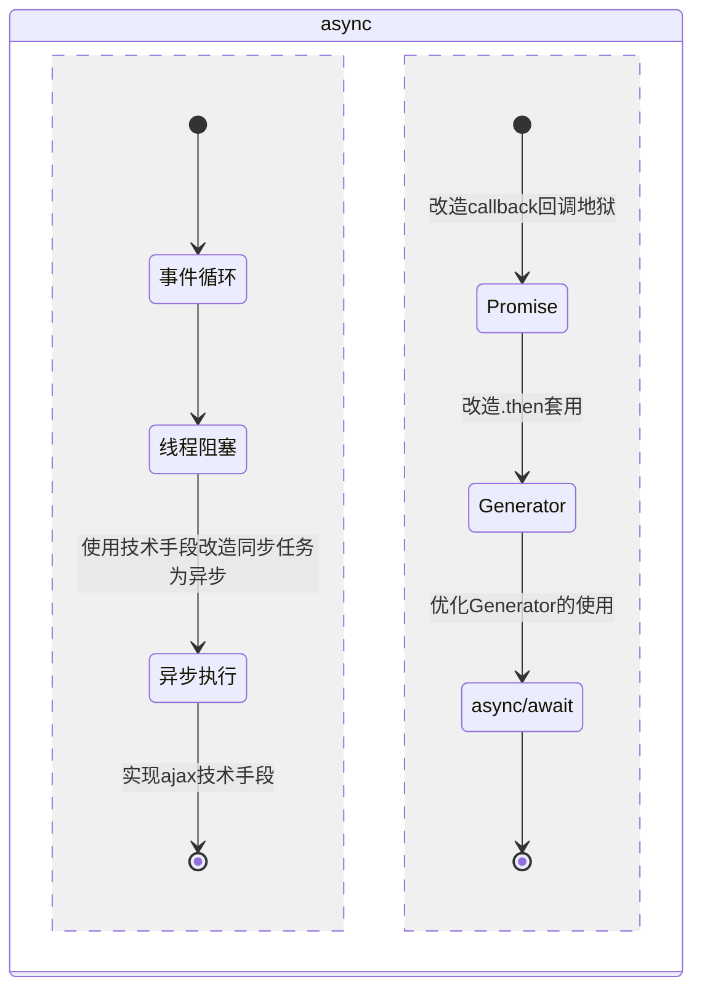

## 异步

### MindMap
+ 什么是异步？
+ 为什么要有异步？
+ 异步的使用场景及技术？
+ EventLoop如何执行的？
+ Promise的核心是什么？


### StateDiagram



### Flowchart

#### 了解异步
JavaScript 是单线程的，意味着它一次只能执行一段代码。如果一个动作需要花费很长时间（如从服务器获取数据），如果不使用异步，整个面可能会因等待而被冻结。  
为了处理异步操作，JavaScript 提供了一些机制。  
主要使用：回调函数、Promise、async/await改造异步，不常用的手段这里不作介绍。

```js
// Promise之前通过callback的方式实现异步
// 异步操作函数
function fetchData(callback) {
  setTimeout(function() {
    let data = 'Async data';
    callback(data);
  }, 2000);
}

// 使用回调函数处理异步操作
fetchData(function(data) {
  console.log(data);
});
```


#### 事件循环

- Event Loop即事件循环，是指浏览器或Node的一种解决javaScript单线程运行时不会阻塞的一种机制，也就是我们经常使用异步的原理。  

- Event Loop分为同步任务和异步任务，同步任务会在调用栈中按照顺序等待主线程依次执行（代码从上到下的执行），异步任务会放进Event Table等异步任务有了结果后，推入Event Queue队列，等待主线程的空闲时调用，以此循环。

- **任务队列分为微任务、宏任务**
- **宏任务大概包括**：script(整体代码), setTimeout, setInterval, setImmediate, I/O, UI rendering。

- **微任务大概包括**: process.nextTick, Promise.then, Object.observe(已废弃), MutationObserver(html5新特性)

- **执行时机：同步任务>微任务>宏任务**  

#### 线程阻塞

```js
// 一个同步阻塞的例子
function longRunningTask() {
  for (let i = 0; i < 1000000000; i++) {
    // 一个非常耗时的计算任务
  }
}
 
// 触发长时间运行的任务
longRunningTask();
 
console.log('这段代码不会被执行，因为页面会冻结。');
```


#### 使用异步
- Promise-避免阻塞（解决异步用回调函数的不方便使用Promise，async简化了异步编程的写法进一步优化了回调地狱）
    ```js
    function longRunningTask() {
      return new Promise((resolve, reject) => {
        setTimeout(() => {
          for (let i = 0; i < 1000000000; i++) {
            // 一个非常耗时的计算任务
          }
          resolve('长时间运行的任务完成');
        }, 0);
      });
    }
    
    // 触发长时间运行的任务
    longRunningTask().then((result) => {
      console.log(result);
    });
    
    console.log('这段代码会立即执行，因为长时间运行的任务是异步执行的。');
    
    ```

#### 内置对象相关
- 实现Promise
    ```js
    class Promises {
        constructor(fn) {
            if (typeof fn !== 'function') {
                return new TypeError("请传入回调函数")
            }
            this.state = "pending";
            this.value = null;
            fn(this.resolve.bind(this), this.reject.bind(this))
        }
    
        resolve(value) {
            if (this.state !== "pending") return;
            this.state = "fulfilled"
            this.value = value;
        }
    
        reject(reason) {
            if (this.state !== "pending") return;
            this.state = "rejected";
            this.value = reason;
        }
    
        then(fulfilled, rejected) {
            if (typeof fulfilled !== 'function' 
            && typeof rejected !== 'function') {
                return this;
            }
    
            if (typeof fulfilled !== 'function' && this.state === 'fulfilled' 
            || typeof rejected !== 'function' && this.state === 'rejected') {
                return this;
            }//判断.catch之间是否存在多个.then
    
            return new Promises((resolve, reject) => {
                if (fulfilled && typeof fulfilled === "function" 
                && this.state === "fulfilled") {
                    let result = fulfilled(this.value);
                    if (result && typeof result.then === "function") {
                        //判断.then是否传入的是Promise
                        return result.then(resolve, reject);
                    } else {
                        resolve(result)
                    }
                }
    
                if (rejected && typeof rejected === "function" 
                && this.state === "rejected") {
                    let result = rejected(this.value);
                    if (result && typeof result.then === "function") {
                        return result.then(resolve, reject);
                    } else {
                        resolve(result)
                    }
                }
            })
        }
    
        catch(rejected) {
            return this.then(null, rejected)
        }
    }
    
    测试数据：正常输出1、3、2、5、4
        new PromiseN((resolve, reject) => {
            console.log(1);
            resolve(2)
            console.log(3)
            setTimeout(() => { console.log(4) }, 0)
        }).then(res => {
            console.log(res)
            return new PromiseN((resolve, reject) => {
                resolve(5)
            }).then(res => {
                return res
            })
        }).then(res => {
            console.log(res)
        }).catch(e => {
            console.log('e', e)
        })
    ```

#### Generator函数

- **async await是Generator的语法糖，比如ES6class构造器是ES5函数构造器的语法糖**

> 遍历器对象（iterator）：类似于数据库中的光标，遍历器对象有两个属性{done：boolean,value:any}

> 在Javascript中，一个函数一旦开始执行，就会运行到最后或遇到return时结束，运行期间不会有其它代码能够打断它，也不能从外部再传入值到函数体内。  

> **而Generator函数（生成器）的出现使得打破函数的完整运行成为了可能**，其语法行为与传统函数完全不同。  
Generator函数是ES6提供的一种异步编程解决方案，形式上也是一个普通函数，但有几个显著的特征：

  1. function关键字与函数名之间有一个星号 “*” （推荐紧挨着function关键字）
  2. 函数体内使用 yield 表达式，定义不同的内部状态 （可以有多个yield）
  3. 直接调用 Generator函数并不会执行，也不会返回运行结果，而是返回一个遍历器对象（Iterator Object）  
  4. 依次调用遍历器对象的next方法，遍历 Generator函数内部的每一个状态
      ```js
      function* gen() {
          yield 'hello'
          yield 'world'
          return 'ending'
      }
      
      let it = gen()
      
      it.next()   // {value: "hello", done: false}
      it.next()   // {value: "world", done: false}
      it.next()   // {value: "ending", done: true}
      it.next()   // {value: undefined, done: true}
      ```


