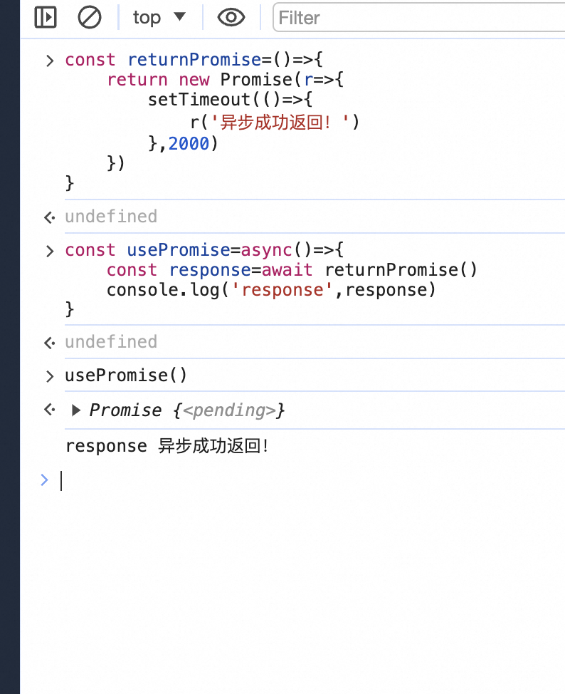
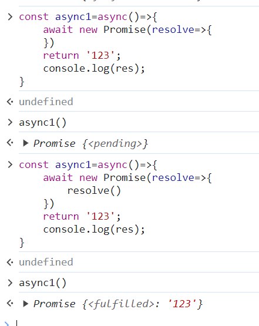

## Promise相关

### 问题
- 什么是Promise？来自于哪个ES版本？为什么有创造Promise？
- Promise的状态有哪些？
- async和Promise的关系？
- Promise的优缺点？
- Promise的错误处理？
- 手写一个简单的Promise？
- Promise之前如何处理异步？
- Promise.all和Promise.allSetlled/Promise.race的区别？
- try catch能捕获Promise的错误吗？
- return一个Promise的用处？
- 为什么async函数能使用.then方法？

### 总结

#### 什么是Promise？来自于哪个ES版本？为什么要创造Promise？

- Promise是ES6的一个新特性，用于解决回调地狱、链式调用、错误处理等问题。

#### Promise的状态有哪些？在Promise之前如何处理异步？

- pending：等待状态，既不是成功也不是失败
- fulfilled：成功状态
- rejected：失败状态

> fulfilled调用resolve，rejected调用reject
> [使用异步](./ECMAScript/[⭐⭐⭐⭐⭐]-ECMAScript-Promise.md#使用异步)

#### Promise的优缺点？

> 优点：解决回调地狱、链式调用、错误处理等问题
> 缺点：无法取消Promise，错误需要通过回调函数捕获

#### Promise错误处理？

> Promise的错误处理有两种方式：
> 1. 在then中的第二个参数中进行错误处理
> 2. 在catch中进行错误处理

#### async和Promise的关系？

>  async/await 是基于Promise的语法糖，可以让异步代码看起来像同步代码。

#### 手写一个简单的Promise？

> [详情](./ECMAScript/[⭐⭐⭐⭐⭐]-ECMAScript-Promise.md#内置对象相关)

#### try catch能捕获Promise的错误吗？

> 不能，因为Promise的错误是异步的，try catch只能捕获同步的错误。
> 但是，可以配合async/await 来捕获Promise的错误。

#### return一个Promise的用处？

>   

#### 为什么async函数能使用.then方法？

>   
> async函数返回的是一个Promise对象，所以可以使用.then方法。但是如果没有使用resolve/reject，那么就会返回一个pending状态的Promise对象，不会向下执行，所以就不会执行.then方法。

#### Promise优秀面试题？
```js
  const async1=async()=>{
    console.log('async1');
    setTimeout(() => {
      console.log('timer1');
    }, 2000);
    await new Promise(r=>{
      console.log('promise1');
    })
    return 'async1 success';
  }
  console.log('script start');
  async1().then(res=>console.log(res))
  console.log('script end');
  Promise.resolve(1)
    .then(2)
    .then(Promise.resolve(3))
    .catch(4)
    .then(res=>console.log(res));
  setTimeout(() => {
      console.log('timer2');
    }, 1000);
```

#### Promise Api

- 作用：解决异步回调地狱的问题。[手写Promise](./[⭐⭐⭐⭐⭐]-ECMAScript-Promise.md#内置对象相关)
- 方法：.then()、.catch()、.finally()、.race()、.all()等
- 区别：
  - promise.all和promise.race可用于处理多个promise实例，接收promise实例为元素的数组作为参数。用promise.all处理时，其中有一个promise实例失败，则返回最先失败的promise；所有promise成功则返回成功。
  - 用promise.race处理时，返回最先得出结果的promise的结果，不管此结果是成功还是失败。
  - promise.allSettled：.all类似同为控制并发，即使有报错依旧会返回全部结果