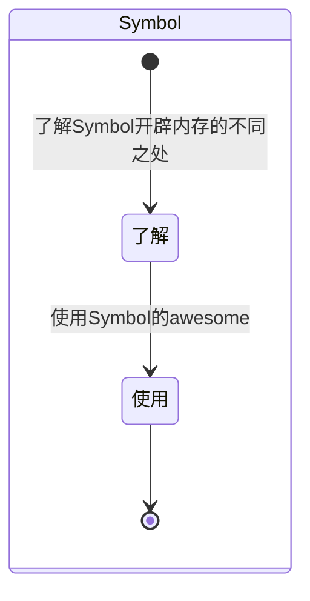

## ES6-Symbol

### MindMap

- 什么是Symbol？
- 主要功能及应用场景是什么？
- 核心优点是什么？
- Symbol和Iterator是怎样的关系？
- Symbol是怎样在内存中开辟空间的？

### StateDiagram

### Flowchart

#### 了解Symbol

- 什么是Symbol？
  - Symbol 是 JavaScript 中的一种原始数据类型。它是在 [ECMAScript](https://so.csdn.net/so/search?q=ECMAScript&spm=1001.2101.3001.7020) 6 (ES6) 标准中引入的，用于表示独一无二的标识符。每个通过 Symbol() 构造函数创建的 Symbol 值都是唯一的，不会与其他任何值相等。
  - Symbol属于基础类型，存在栈中

#### 应用场景

- 当使用第三方库的时候，需要在原数据结构上面增加属性，为避免覆盖的情况出现，此时应该使用Symbol构造函数，生成一个唯一的属性。