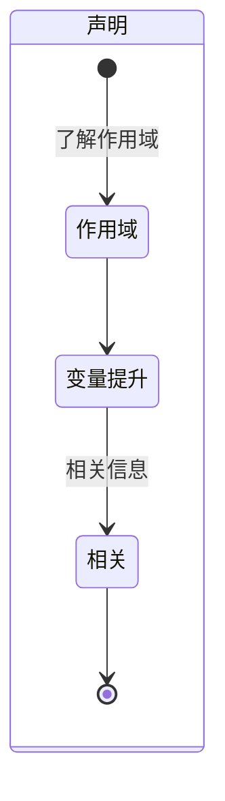
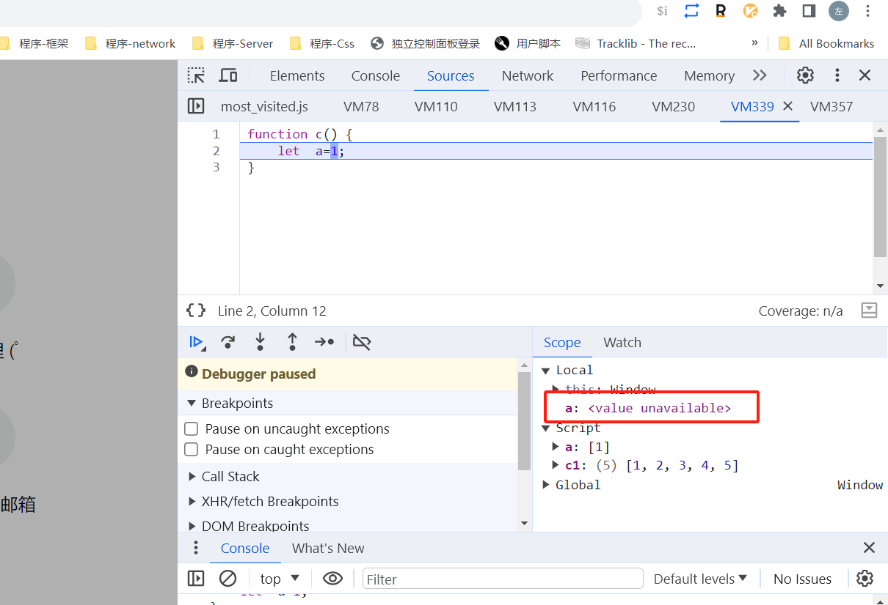
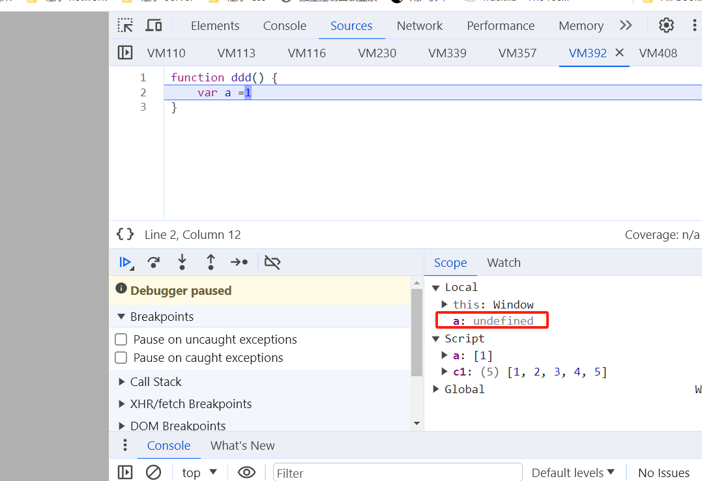
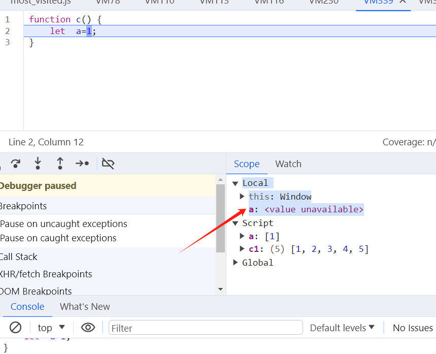

## ES6-let/const

### MindMap

- 涉及到作用域
  - 如何在谷歌浏览器里面查看作用域：F12-->Sources-->Pause-->执行函数
  - 全局作用域/局部作用域
  - 作用域绑定
- 闭包
- 变量提升
- 暂时性死区
- 什么情况下要用到let/const
- 原理是什么？

### StateDiagram

### Flowchart

#### 作用域相关

- 谷歌浏览器里面查看作用域：F12-->Sources-->Pause-->执行函数
- 全局作用域（global scope）：最顶层的作用域
- 局部作用域（local scope）：函数内部定义的变量
- 作用域链：从当前作用域查找变量，如果没有就向上层作用域进行查找，直到找到全局作用域为止。
- 三个作用域
  - 

#### 变量提升

- var存在变量提升，函数无论是否执行，内部的变量都会被提升至最顶端，并且声明为Undefined，在local scope中为undefined
  - 
- let const 不存在变量提升，如果不执行函数，变量不会被声明，如果此时访问这个变量会报错，这个就叫暂时性死区
  - 