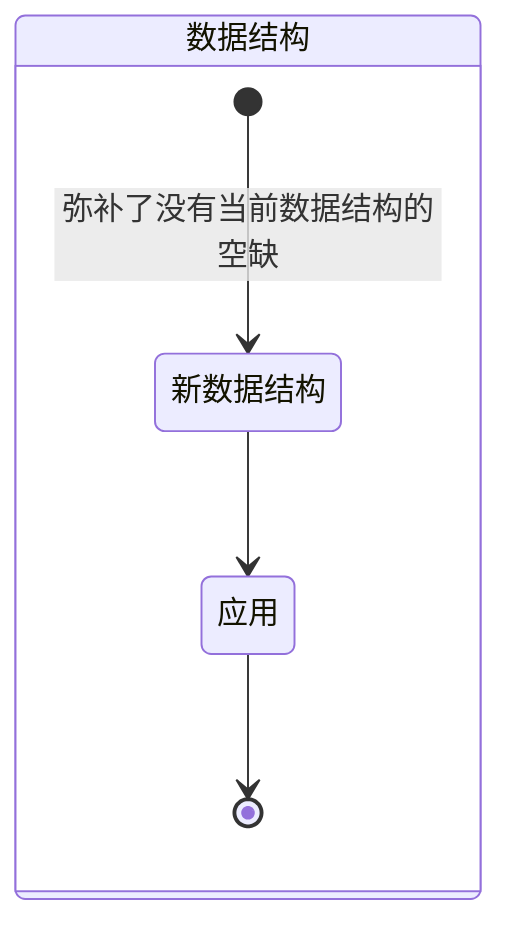
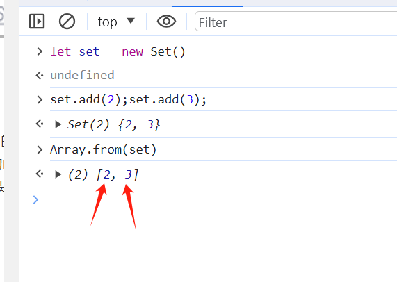

## 新增数据结构

### MindMap

- 新增的数据结构发挥的作用是什么？
- 新增了什么数据结构？
- 真实场景的案例有哪些？

### StateDiagram




### Flowchart

#### 新数据结构-Set（作为Array的补充）
- 特点：唯一性、集合运算（交集、并集、差集）、迭代顺序一致[图解](../../images/7eaec8c54e5763997fe7572ea98449f3a529c8a3900b37fb6d380986d1d8f039.png)  
- 主要弥补了数组处理集合的一些不足

##### 唯一性

```js
// 1  数组去重
const arr = [1, 2, 3, 2, 1];
const set = new Set(arr);
const newArr = Array.from(set); // newArr = [1, 2, 3]
```

##### 集合运算

```js
let setA=new Set([1,2,3,4,5])
let setB=new Set([6,7,8,9,0])

// 并集（数组+另一个数组不重复的部分）
let unionSet=new Set([...setA,...setB])

// 交集
let intersectionSet=new Set([...setA].filter(x=>setB.has(x)));

// 差集
let differenceSet=new Set([...setA].filter(x=>!setB.has(x)));
```

##### 迭代一致性



#### 新数据结构-WeakSet

- 特点：弱引用、只能存储引用地址，只作为临时存储使用
  - 弱引用：内存自动回收时不会在意WeakSet的引用，会直接回收


#### 新数据结构-Map（作为Object的补充）

- 特点：entries二维数组存储、可以以任何数据结构作为键名、自定义键名不会与内置属性冲突、可迭代性


#### 新数据结构-WeakMap

- 特点：功能类似于Map，但是为弱引用。

