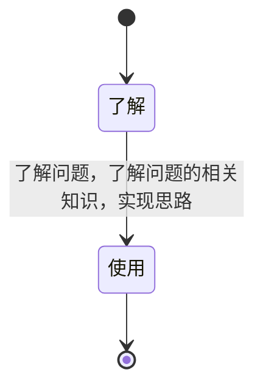

## 交集并集差集
### 灵感
- 什么是交集并集差集？
- 交集并集差集的应用场景？
- 如何实现交集并集差集？
- 什么是Set数据结构？

### 提炼


### 总结
- Set数据结构？
  - 了解Set数据结构？
    - Set数据结构是一种能够储存无重复值的集合，是ES6中新增的数据类型。
    - Set的设计初衷不是用来取代Array，而是提供某种额外的支持完成Array所缺乏的。
  - 有哪些方法，如何使用？
    - 增:add()
    - 删:delete()、clear()
    - 查:has()检查元素是否存在
  - Array.from是做什么的？
    - 将类数组对象转换为数组对象(带有length并且key为数字的对象)
- 什么是交集并集差集？
  - [图解](../images/7eaec8c54e5763997fe7572ea98449f3a529c8a3900b37fb6d380986d1d8f039.png)  
  - 在JS中如何实现呢？
    ```
      var a = [1,2,3,4,5]
      var b = [2,4,6,8,10]
      console.log("数组a：", a);
      console.log("数组b：", b);
      
      var sa = new Set(a);
      var sb = new Set(b);
      
      // 交集（a和b共有的）
      let intersect = a.filter(x => sb.has(x));
      
      // 差集（a里面没有的）
      let minus = a.filter(x => !sb.has(x));
      
      // 补集
      let complement  = [...a.filter(x => !sb.has(x)), ...b.filter(x => !sa.has(x))];
      
      // 并集（a和b相加的）
      let unionSet = Array.from(new Set([...a, ...b]));
      
      console.log("a与b的交集：", intersect);
      console.log("a与b的差集：", minus);
      console.log("a与b的补集：", complement);
      console.log("a与b的并集：", unionSet); 
    ```
  