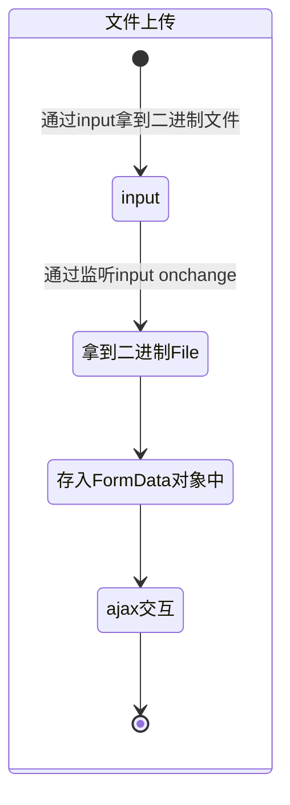
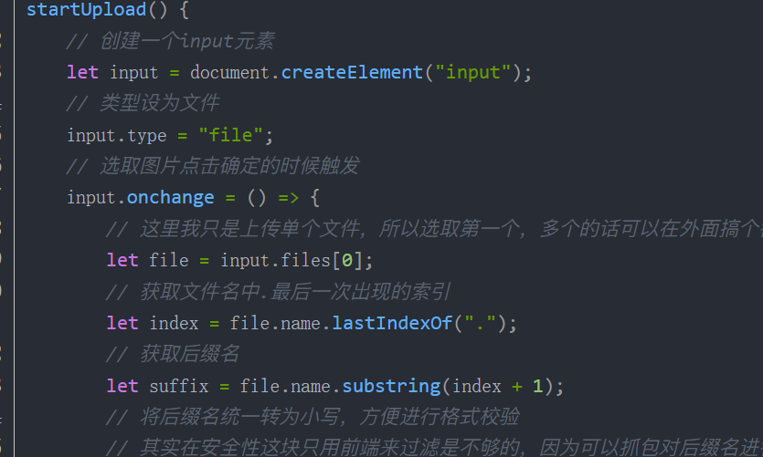
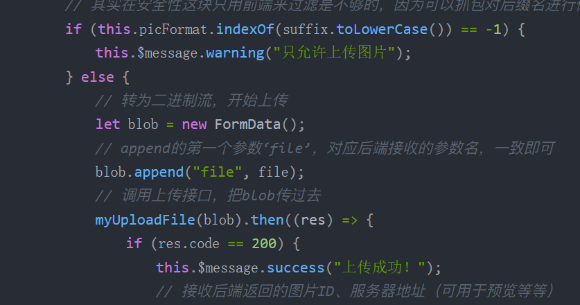
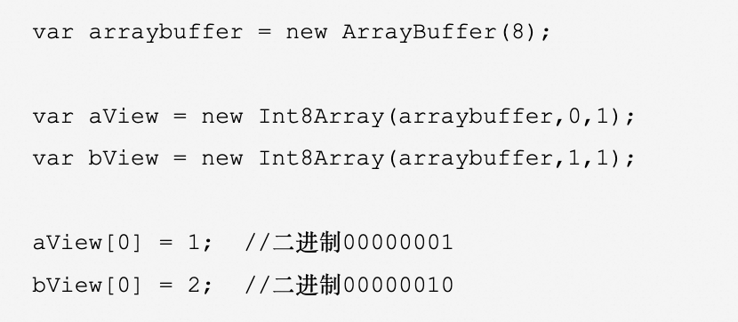

# 前端文件上传

## MindMap
- 什么是二进制上传？
- 二进制上传跟图片是怎样的关系？
- 都有哪些原生的api？
- 实现一个图片预览？
- 图片如何转Blob格式？
- 使用场景以及如何使用？
- 什么是MIME类型？
- ant design upload组件的实现原理？

## StateDiagram

## Flowchart

#### Input取二进制文件

- 原生input表单的type="file"支持接收二进制的文件

  - ​	

- 什么是二进制上传？

  > 计算机是二机制的世界，字节(Byte/B)作为二机制的基本单位，1个字节有8个二机制位，即8bit。
  > 一个字节有256种状态，取值从00000000～11111111。

- 什么是MIME类型？

  > MIME类型是描述消息内容类型的标准，用来表示文档、文件或字节流的性质和格式。有两个分类：MIME媒体类型和MIME子类型。
  > 常见的MIME类型有：text/html、text/plain、image/jpeg、image/png、image/gif、application/json、application/javascript、application/pdf、application/zip、application/octet-stream、multipart/form-data等。

- 二进制上传跟图片是怎样的关系？

  > 图片是一种二进制数据，可以通过二进制Blob上传的方式上传到服务器端。

#### 上传二进制

- 拿到二进制文件以后创建FromData对象，存储file文件，上传至服务端。

  - 

- 相关的WebApi？

  > Blob、File、FileReader、URL.createObjectURL、FormData... 
  > [点此查看另一个仓库案例](https://github.com/liquidGo/Abstract_Key_Processes/blob/master/src/other/whatIsBinaryObject/01_Blob/index.tsx)
  > [参考文档](https://zhuanlan.zhihu.com/p/568915443?utm_id=0)

  > ArrayBuffer：将二进制数据存入栈中。
  >   

  > Blob：前端专门用于支持文件操作的二进制对象，他的特点是不可变。
  > new Blob([data], {type: 'image/png'})，第一个参数是一个数组，数组的每一项都是一个二进制数据，第二个参数是一个对象，用来指定MIME类型。

  > File：继承自Blob，扩展了name、lastModified、lastModifiedDate属性，用来表示文件的名称、最后修改时间、最后修改时间戳。

  > FileReader：是一个异步的API，用于读取文件提取其内容供进一步使用。可以通过onprogress、onload、onerror、onabort等事件来监听读取过程。

  > URL.createObjectURL：是一个JavaScript函数，用于创建一个指向File对象或者Blob对象的URL。

  > FormData：是一个表单数据对象，用于将表单数据转换成键值对的形式，用于发送到服务器端。可以通过new FormData(formDom)来创建一个FormData对象，也可以通过append方法来添加键值对。
  > FormData和普通对象的区别：FormData可以上传文件、FormData可以通过方法写入/读取键值对、FormData可以读取form表单的数据。

