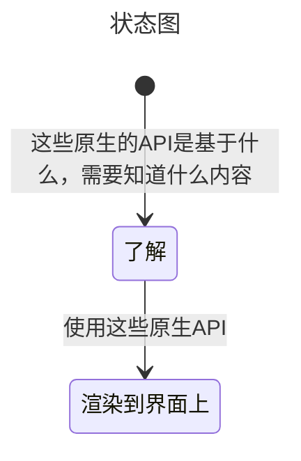
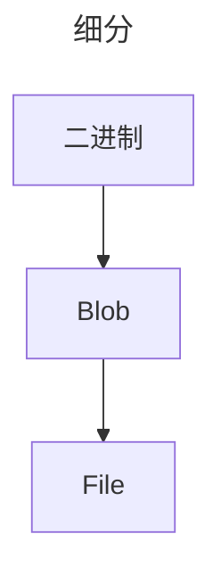

## 前端文件上传

### MindMap
- 什么是二进制上传？
- 二进制上传跟图片是怎样的关系？
- 都有哪些原生的api？
- 实现一个图片预览？
- 图片如何转Blob格式？
- 使用场景以及如何使用？
- 什么是MIME类型？
- ant design upload组件的实现原理？

## 抽象

### 总结
- 什么是二进制上传？
  > 计算机是二机制的世界，字节(Byte/B)作为二机制的基本单位，1个字节有8个二机制位，即8bit。
  > 一个字节有256种状态，取值从00000000～11111111。

- 什么是MIME类型？
  > MIME类型是描述消息内容类型的标准，用来表示文档、文件或字节流的性质和格式。有两个分类：MIME媒体类型和MIME子类型。
  > 常见的MIME类型有：text/html、text/plain、image/jpeg、image/png、image/gif、application/json、application/javascript、application/pdf、application/zip、application/octet-stream、multipart/form-data等。

- 相关的WebApi？
  > Blob、File、FileReader、URL.createObjectURL、FormData... 
  > [点此查看另一个仓库案例](https://github.com/liquidGo/Abstract_Key_Processes/blob/master/src/other/whatIsBinaryObject/01_Blob/index.tsx)

  > Blob：前端专门用于支持文件操作的二进制对象，他的特点是不可变。
  > new Blob([data], {type: 'image/png'})，第一个参数是一个数组，数组的每一项都是一个二进制数据，第二个参数是一个对象，用来指定MIME类型。

- 二进制上传跟图片是怎样的关系？