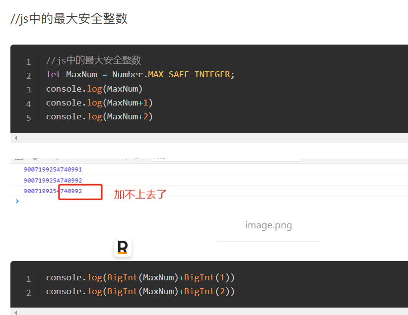

# ES新特性

## ECAMAScript6(2015)	

- [模块导出](https://github.com/tc39/proposal-export-default-from)
- 箭头函数
- 类（有了构造器的概念，可以用super实现继承）
- 模板字符串
- 对象字面量：{name:name}==={name}
- [尾递归](./ECMAScript/[⭐⭐⭐⭐⭐]-ECMAScript-尾递归.md)
- 解构赋值/不定参数
- [Promise](./ECMAScript/[⭐⭐⭐⭐⭐]-ECMAScript-Promise.md)
- [Iterator](./ECMAScript/[⭐⭐⭐⭐⭐]-ECMAScript-Iterator迭代器.md)+for...of(遍历带Iterator的值)
- [Let Const](./ECMAScript/[⭐⭐⭐⭐⭐]-ECMAScript-constlet.md)
- [Symbol](./ECMAScript/[⭐⭐⭐⭐⭐]-ECMAScript-Symbol.md)
- [Set+WeakSet+Map+WeakMap](./ECMAScript/[⭐⭐⭐⭐⭐]-ECMAScript-新增数据结构.md)
- [Array+String+Object](./ECMAScript/[⭐⭐⭐⭐⭐]-ECMAScript-数据结构Apis.md)

## ECMAScript7(2016)

- [Array+String+Object](./ECMAScript/[⭐⭐⭐⭐⭐]-ECMAScript-数据结构Apis.md#ECMAScript7(2016))
- Generator语法糖-async/await

## ECMAScript8(2017)

- [Array+String+Object](./ECMAScript/[⭐⭐⭐⭐⭐]-ECMAScript-数据结构Apis.md#ECMAScript8(2017))

## ECMAScript9(2018)

- 更新Promise.finally

## ECMAScript10(2019)

- [Array+String+Object](./ECMAScript/[⭐⭐⭐⭐⭐]-ECMAScript-数据结构Apis.md#ECMAScript10(2019))

## ECMAScript11(2020)

- 更新Promise.allSettled
- 动态Import：可以用addEventLister监听器，进行逻辑判断并且动态导入函数。
- 空值合并运算符(??)：如果左侧不为null/undefined则返回左侧，反之。
- 可选链式运算符(?.)：如果对象的属性不存在不会抛出错误，会抛出undefined
- BigInt数据结构：
  - 

## ECMAScript12(2021)

- 更新Promise.any方法：只返回第一个成功的，全部失败才返回报错
- 逻辑与赋值运算符(&&=)：只有当左侧为真才会赋值：let a=1; a&&=2;    // a===2; true
- 逻辑或赋值运算符(||=)：与逻辑与赋值运算符相反
- 逻辑空赋值运算符(??=)：只有在左侧为undefined/null的时候才会进行赋值

## ECMAScript13(2022)

- Object.hasOwn：替代{}.hasOwnProperty，更简便

## ECMAScript14(2023)

- [Array+String+Object](./ECMAScript/[⭐⭐⭐⭐⭐]-ECMAScript-数据结构Apis.md#ECMAScript14(2023))

