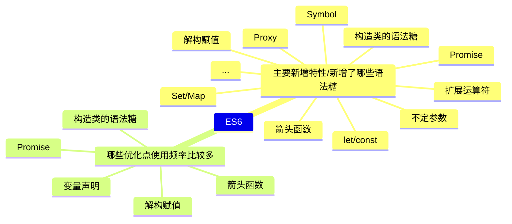

## ES6相关

### ES6的主要变化

```mermaid
mindmap
ES6
    主要新增特性/新增了哪些语法糖
        let/const
        箭头函数
        解构赋值
        扩展运算符
        不定参数
        构造类的语法糖
        Symbol
        Set/Map
        Proxy
        Promise
        ...
    哪些优化点使用频率比较多
        箭头函数
        解构赋值
        变量声明
        Promise
        构造类的语法糖
```
