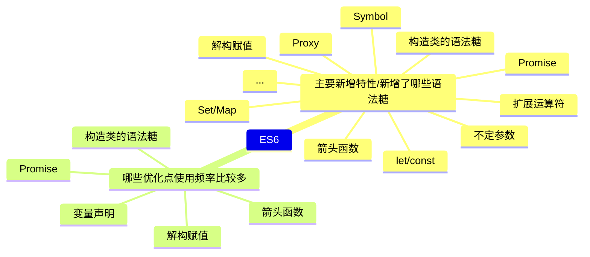

## ES6相关

### ES6的主要变化



### 详细解析

#### let/const/var
- var：存在变量提升，可以重复声明，没有块级作用域
- let：不存在变量提升，不可以重复声明，有块级作用域，暂时性死区（声明前使用会报错）
- const：不存在变量提升，不可以重复声明，有块级作用域，声明时必须赋值，赋值后不可修改，暂时性死区
- 暂时性死区：

#### 构造器的语法糖
[点击跳转](./[⭐⭐⭐⭐⭐]-面向对象.md#es56的面向对象手段)

#### 箭头函数
[点击跳转](./[⭐⭐⭐⭐⭐]-面向对象.md#箭头函数的特点)

#### Proxy拦截器
- 作用：拦截对象的读取、赋值、函数调用等操作
- 语法：`let proxy = new Proxy(target, handler)`
- 案例：  
    ```
    let xiaohong = {
        name: "小红",
        age: 15
    };
    let proxyObj = new Proxy(xiaohong, {
        get(target, key) {
        let result = target[key];
        //如果是获取 年龄 属性，则添加 岁字
        if (key === "age") result += "岁";
        return result;
        },
        set(target, key, value) {
        if (key === "age" && typeof value !== "number") {
            throw Error("age字段必须为Number类型");
        }
        return Reflect.set(target, key, value);
        }
    });
    console.log(`我叫${proxyObj.name}  我今年${proxyObj.age}了`);
    proxyObj.age = "aa";
    ```

#### Promise

- 作用：解决异步回调地狱的问题[手写Promise](./[⭐⭐⭐⭐⭐]-异步.md#内置对象相关)
- 方法：.then()、.catch()、.finally()、.race()、.all()等
- 区别：promise.all和promise.race可用于处理多个promise实例，接收promise实例为元素的数组作为参数。用promise.all处理时，其中有一个promise实例失败，则返回最先失败的promise；所有promise成功则返回成功。用promise.race处理时，返回最先得出结果的promise的结果，不管此结果是成功还是失败。

#### WeakMap/Map/Symbol
- WeakMap
  - [WeakMap](../images/3b0f26c4d6a99177401edf448a7ff70a54096eb5b34ca70ff416e3ba33b00384.png)  
