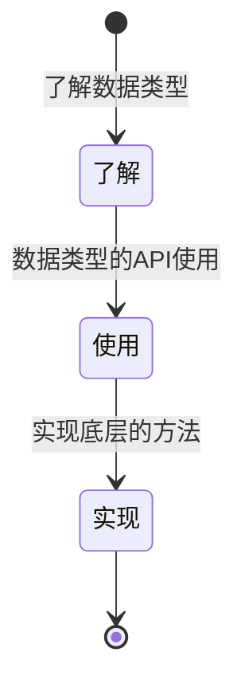

## 数据类型
### 灵感
- 什么是数据类型？
- 什么是引用类型？什么是值类型？
- 什么是内存？堆栈如何存储在内存中？
- JavaScript有哪些数据类型？
- 如何判读数据类型？
- 常用的处理数据类型的API有哪些？
- 哪些数据类型会自动转换？
- 什么是堆栈？
- 什么是垃圾回收机制？
- 内存是怎样存在的？垃圾回收机制是如何操作内存的？
- 什么是symbol类型？什么是weakMap？什么是Map数据结构？
- 判断类型的方法？

### 状态

### 总结
- 什么是数据类型？
  - 数据类型就是规定了数据储存的格式，以及对数据的操作。
- 什么是引用类型？什么是值类型？
  - 引用类型：复合数据类型，变量储存的是内存地址，重新赋值依旧是同一个内存地址，内存地址指向堆中存放的对象或者数组。
  - 值类型：基本数据类型，变量储存的是值，重新赋值是新的变量，存在栈中，直接进行入栈或者出栈。
- 什么是堆？什么是栈？什么是代码块？
  - 首先函数的代码是静态的，储存在代码块中，当函数执行的时候在栈中存入变量或者在栈中引用在堆中的对象或者数组。
- 什么是垃圾回收机制？
  - 当执行代码块中的函数后，压入的变量或者内存地址会出栈，但是堆中的对象或者数组依然存在于内存之中没有被释放，这个时候堆就需要用到垃圾回收机制了。
  - 标记-->清除阶段：当内存使用达到一定的阈值的时候，会启用垃圾回收的机制的清除机制，标记会自动对被引用的对象进行打标，在清除阶段会清除那些没有被打标的对象或者数组，这就是垃圾回收机制。
  - 标记还有其他的方式：类似于引用计数，引用一次加一出栈一次减去一。
- 为什么要区分引用类型和值类型？
  - 因为引用类型是占用内存空间较为大的，如果每次都重新赋值会浪费较多的内存空间，会造成内存的浪费。
- 哪些基本类型？哪些引用类型？
  - 基本数据类型：Number、String、Boolean、undefined、null、Symbol
  - 引用类型：Object、Array
- 什么是Map、WeakMap、Map数据结构？
  - [详情](./[⭐⭐⭐⭐⭐]-ES6相关.md#weakmapmapsymbol)
- 判断类型的方法？
  - typeof：判断基本数据类型，但是不能判断null和Array
  - instanceof：判断引用类型，但是不能判断null
  - Object.prototype.toString.call()：判断所有类型
  - Array.isArray()：判断数组
  - constructor：判断所有类型
- 数据结构常用的原生方法有哪些？
  - 数组：
    - 增：push、unshift、splice
      - push/unshift：从前后插入返回数组长度
      - splice：(开始位置，删除个数，插入的元素)返回删除的元素。可实现替换、删除、插入
    - 删：pop、shift、splice
      - pop/shift：从前后删除返回删除的元素
      - splice：(开始位置，删除个数，插入的元素)返回删除的元素。可实现替换、删除、插入
    - 改：splice
      - splice：(开始位置，删除个数，插入的元素)返回删除的元素。可实现替换、删除、插入
      - sort：(a,b)=>{return a-b}从小到大排序[实现](../05_算法/[⭐⭐⭐⭐⭐]-四种基本的算法.md)
    - 查：indexOf、lastIndexOf、includes、find、findIndex、filter、forEach、some、every、map、reduce、reduceRight
      - some：只要有一个满足条件就返回true
      - every：只有全部满足条件才返回true
      - reduce：((上一个的累加值，当前值，当前索引，原数组)=>{return 返回累加值},初始值)
  - 对象：
    - 增：obj[key]=value、Object.assign(obj,{key:value})、Object.defineProperty(obj,key,{value:value,enumerable:true})
      - Object.assign：合并对象，后面的对象会覆盖前面的对象，属于浅拷贝，目标对象的地址会被改变。
      - Object.defineProperty（vue2响应式实现原理）：(对象，属性名，{value:value,enumerable:true,get(){},set(){}})，enumerable为true的时候才可以被枚举，也就是可以被遍历。在set的时候调用update方法，更新视图。
    - 删：delete obj[key]
    - 改：obj[key]=value、Object.keys(obj)、Object.values(obj)、Object.entries(obj)将对象的键值对转换成数组
    - 查：obj[key]、obj.key
  - 其他构造器常用方法：[详情](https://blog.csdn.net/qq_21891743/article/details/106739938)