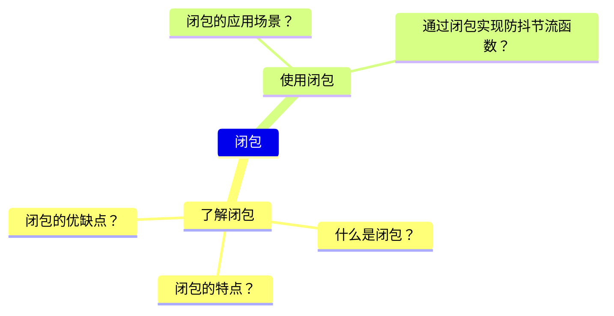
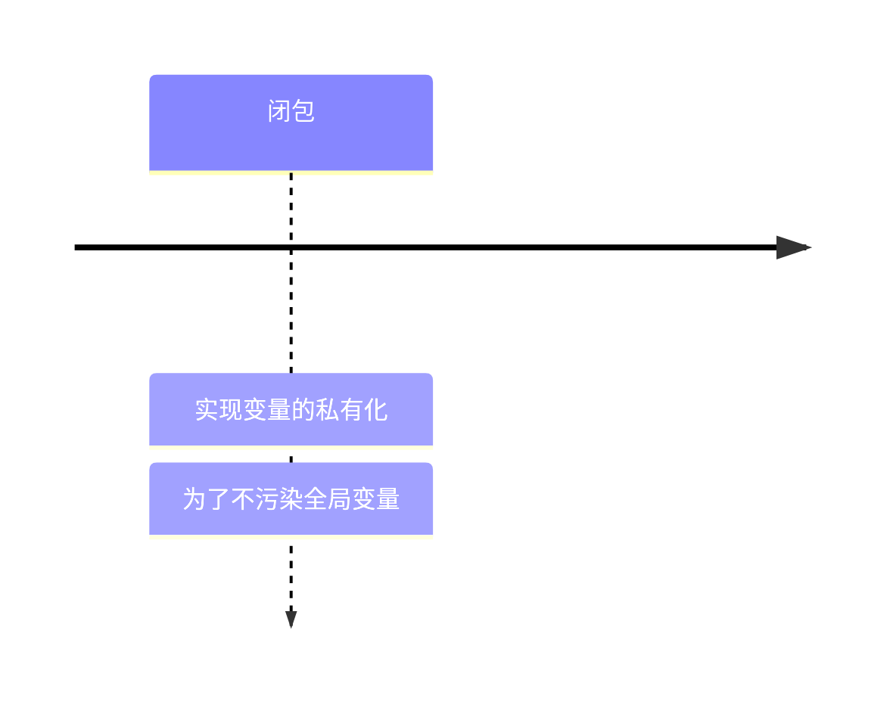
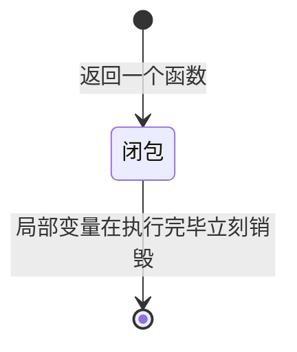

## 闭包相关

### 思维导图

### 类似方式

### 状态图

### 总结
#### 了解闭包
- 什么是作用域？
    > 作用域是指变量的有效范围，作用域分为全局作用域和局部作用域。   
    > 作用域的作用就是防止变量间的互相干扰  
    > 全局作用域(GO)：在函数外层声明的变量
    > 局部作用域(LO)：在函数内层声明的变量
- 什么是作用域链？
    > 作用域链是指变量的查找机制，作用域链分为全局作用域链和局部作用域链。