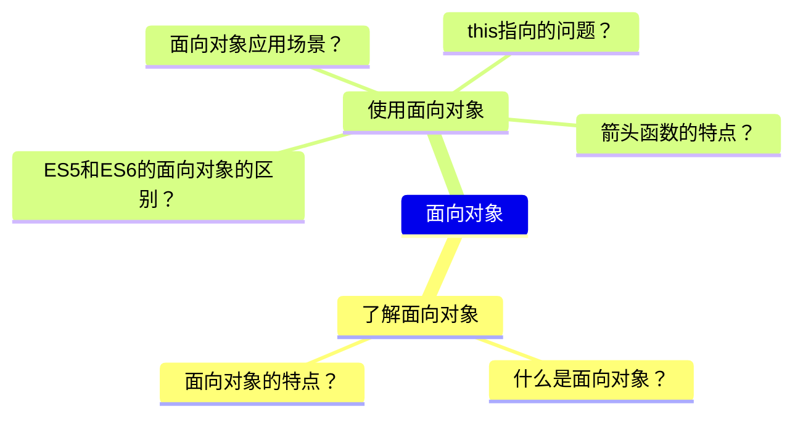
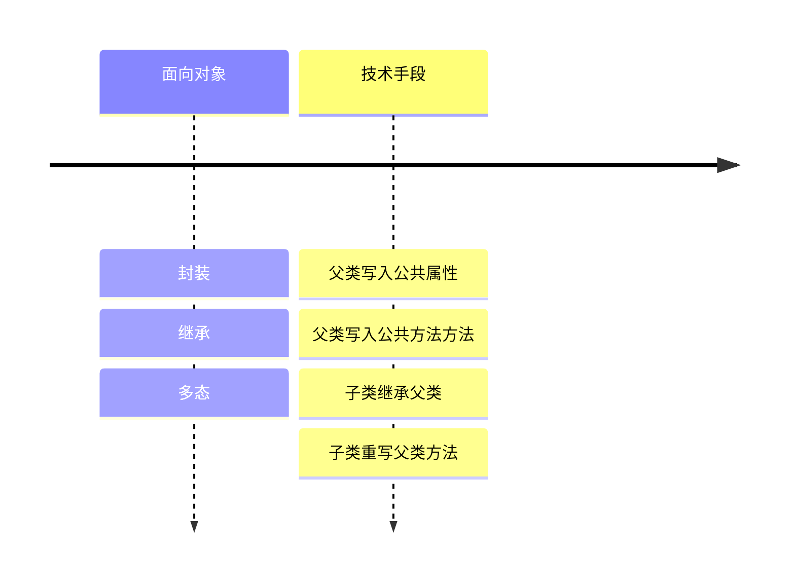
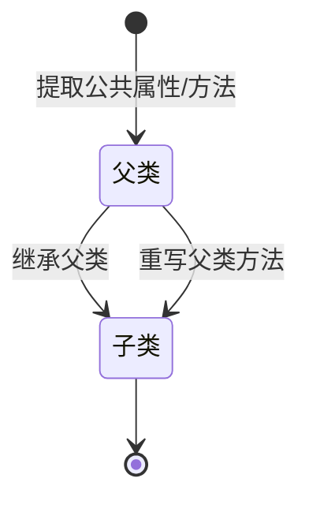

## 面向对象相关

### 思维导图

### 类似方法

### 状态图

### 总结
#### ES5/6的面向对象手段
- ES5
    > ES5中的构造器是通过构造函数实现的，通过new的方式进行挂载属性。  
    > ES5中的公共方法是通过prototype原型链的挂载实现的。  
    > ES5中的继承是通过call的方式实现的
- ES6
    > ES6中的构造器是通过class类实现的，通过new的方式进行挂载属性。  
    > ES6中的公共方法是通过extends继承实现的。  
    > ES6中的继承是通过super的方式实现的
#### this指向的问题
- this指向调用者
- this指向新new的Object对象
- 自调用函数的this指向window
- 构造函数的prototype原型链的this指向实例对象
- this指向触发事件的dom对象
- 箭头函数的this指向上下文的this

#### 箭头函数的特点
- 箭头函数没有自己的this，它的this是继承而来的
- 箭头函数没有arguments
- 箭头函数不能作为构造函数，不能使用new 
- 箭头函数没有super