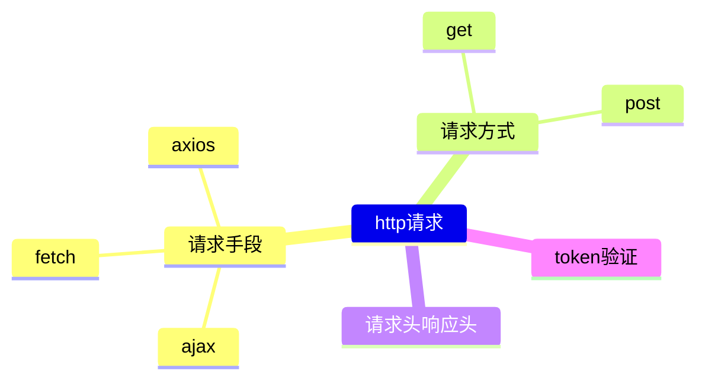

## http

### 导图

```mermaid
mindmap
    http请求
        请求手段
            ajax
            fetch
            axios
        请求方式
            get
            post
        请求头响应头
        token验证
```

### 抽象
#### 请求手段
- axios/fetch/ajax的区别？
  - Ajax:
#### 请求方式
#### 拦截
#### Jwt鉴权
