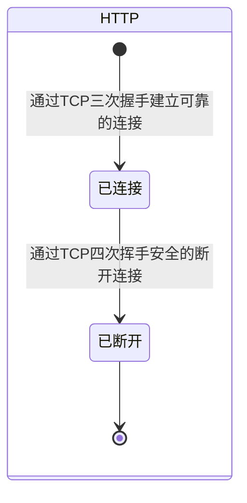
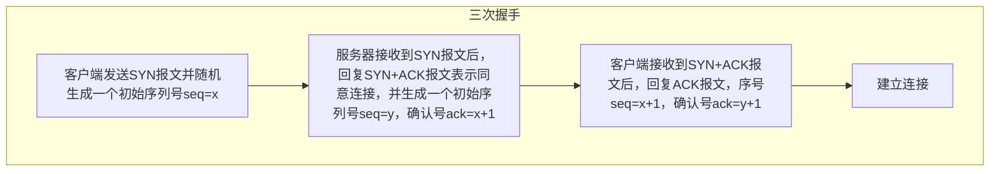
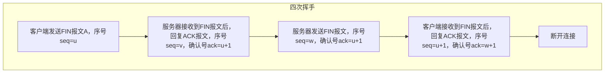
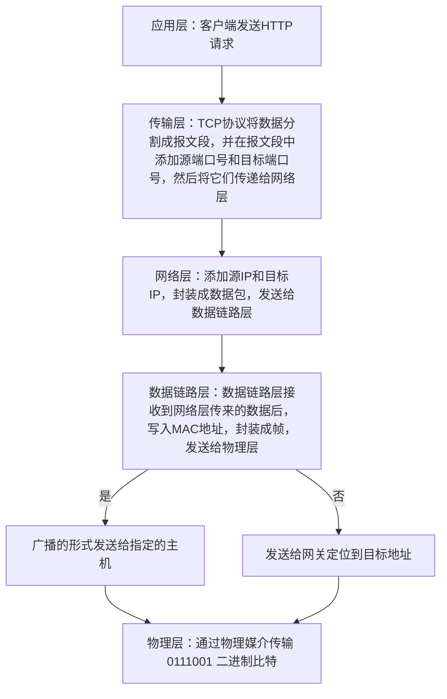

## 网络相关

### MindMap

- 什么是 HTTP/TCP 网络协议？
- HTTP请求页面和请求接口有什么区别？
- 他们是如何在前端层面应用的？
- TCP是如何规范HTTP/FTP协议的？
- 请求HTTP常用的技术手段？
- 什么是DNS？
- 为什么要分层？
- 什么是三次握手四次挥手？

### StateDiagram

### 总结
- 什么是DNS？
  - DNS是服务器，用于将域名解析成IP地址，在拿到一个域名的时候首先需要将域名和服务器的IP地址进行绑定，当访问这个域名的时候，首先会访问DNS服务器，然后DNS服务器会将域名解析成IP地址，然后再访问这个IP地址。
- HTTP请求页面和接口的区别？
  - 请求页面和接口都是相同的过程：
    - 首先通过DNS将域名解析成IP地址
    - 通过三次握手建立TCP可靠的连接
    - 发送请求
    - 响应请求
    - 断开连接
    - 浏览器解析HTML[查看浏览器渲染过程](../02_HTML/[⭐⭐⭐⭐]-HTML.md#浏览器渲染过程)
    - 渲染到页面上
- HTTP协议和FTP协议的区别？介绍一下他们各自的应用场景？
  - HTTP协议(hyperText Transfer Protocol：超文本传输协议)：主要是面向页面，通过一定的流程进行页面/接口的请求将数据渲染为页面，或者将数据通过Ajax的异步手段刷新到指定的区域上。
  - FTP（File Transfer Protocol：文件传输协议）：主要是面向文件的，需要身份验证然后进行文件的上传或者下载处理。
- 请求HTTP常用的技术手段？[常用的请求方式](./[⭐⭐⭐⭐⭐]-HTTP请求.md#请求手段)
- TCP是如何规范HTTP/FTP协议的？
  - TCP只是建立连接并且发送数据包，并且有一些较好的特性：
  - 可靠性：TCP 致力于确保数据在发送和接收之间的可靠传输。它使用各种机制，如序号、确认和重传，以确保数据包的完整性和按顺序到达。
  - 有序性：TCP 确保数据包按照发送的顺序到达。如果数据包在传输过程中丢失，TCP 将重新发送数据包，而不是将其丢弃。
  - 面向连接：三次握手建立连接，四次挥手断开连接。 
  - 全局唯一标识：TCP 使用 IP 地址和端口号来标识每个连接的两端。
  - ...
- TCP和UDP的区别？
  - TCP是面向连接的，UDP是面向无连接的。
  - TCP一般用于对数据传输要求比较高的场景，而UDP一般用于对数据传输要求不高的场景可以容忍一定数据丢失的场景。

#### 三次握手四次挥手

> 防止不必要的资源浪费，保证数据的可靠传输，避免过期的数据包传输到服务器端。

#### 经典五层模型介绍

- 交互-->传输-->网络-->设备-->电传播

1. 应用层

   > HTTP 协议：应用层协议，基于 TCP 协议，基于请求响应模型，无状态。

   - HTTP
   - FTP
   - ...

2. 传输层
   > TCP 协议：传输层协议，基于 IP 协议，把请求封装成段并写入端口。  
   > 特点是可靠传输，基于字节流，提供拥塞控制，流量控制，错误恢复等功能。
   - TCP
   - UDP
   - ...
3. 网络层
   > IP 协议：网络层协议，加入 ip 地址封装成包，通过 IP 地址进行寻址。
4. 数据链路层
   > 数据链路层：链路层协议，加入 Mac 地址封装成帧，通过 MAC 地址进行寻址。
5. 物理层

   > 通过物理媒介传输 0111001 二进制比特。

   - 电磁波
   - 光、电
   - ...

#### 五层模型过程

