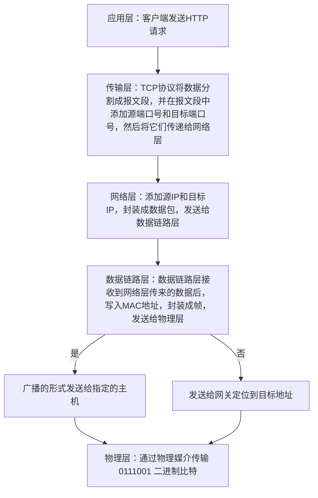
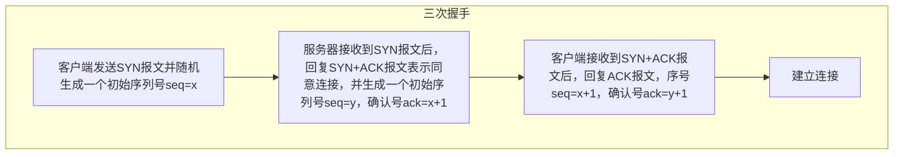
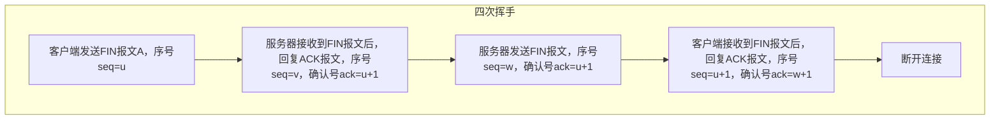

## 网络相关

### 相关知识点

- 经典五层模型
- HTTP 协议

### 问题抽象

- 什么是 HTTP/TCP 网络协议？
- 为什么要分层？
- 什么是三次握手四次挥手？
- 面试如何解答？

### 总结

#### 经典五层模型介绍

1. 应用层

   > HTTP 协议：应用层协议，基于 TCP 协议，基于请求响应模型，无状态。

   - HTTP
   - FTP
   - ...

2. 传输层
   > TCP 协议：传输层协议，基于 IP 协议，把请求封装成段并写入端口。  
   > 特点是可靠传输，基于字节流，提供拥塞控制，流量控制，错误恢复等功能。
   - TCP
   - UDP
   - ...
3. 网络层
   > IP 协议：网络层协议，加入 ip 地址封装成包，通过 IP 地址进行寻址。
4. 数据链路层
   > 数据链路层：链路层协议，加入 Mac 地址封装成帧，通过 MAC 地址进行寻址。
5. 物理层

   > 通过物理媒介传输 0111001 二进制比特。

   - 电磁波
   - 光、电
   - ...

#### 流程总结

#### HTTP/TCP 网络协议

> HTTP 负责定义客户端和服务器之间的通信规则以获取和传输 Web 资源，而 TCP 负责在底层提供可靠的数据传输和连接管理。在浏览网页的过程中，HTTP 和 TCP 共同工作，确保您能够顺畅访问网站并获取所需的信息。

TCP 特点：

- 可靠性：TCP 致力于确保数据在发送和接收之间的可靠传输。它使用各种机制，如序号、确认和重传，以确保数据包的完整性和按顺序到达。

- 有序性：TCP 确保数据包按照发送的顺序到达。如果数据包在传输过程中丢失，TCP 将重新发送数据包，而不是将其丢弃。
- 面向连接：三次握手建立连接，四次挥手断开连接。 - 全局唯一标识：TCP 使用 IP 地址和端口号来标识每个连接的两端。
- ...

HTTP 特点：

- 无状态：HTTP 是一种无状态协议，这意味着每个 HTTP 请求都是独立的，服务器不会保持关于客户端的任何信息。这有助于服务器的扩展性，但也需要在每个请求中包含足够的信息来处理它。  
- 支持多媒体内容：HTTP 不仅可以传输超文本文档（HTML），还可以传输各种多媒体内容，如图像、音频和视频。这使得互联网上的各种媒体资源可以通过 HTTP 访问。

#### IP 寻址还需要使用到 mac 地址吗？

> IP 地址和 MAC 地址在网络通信中是相互配合的，各自具有不同的功能。IP 地址用于全球范围的路由，而 MAC 地址用于局域网内的本地通信。

#### 三次握手四次挥手

> 防止不必要的资源浪费，保证数据的可靠传输，避免过期的数据包传输到服务器端。

