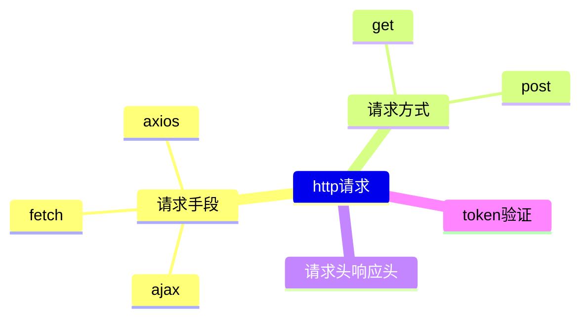

## http

### 导图

### 抽象
#### 请求手段
- axios/fetch/ajax的区别？
  - Ajax: Ajax是基于XMLHttpRequest技术手动封装实现局部刷新数据、异步获取数据的开发方案
    - 缺点：封装复杂、兼容性差等
    - 优点：早期实现局部刷新的方法、异步获取数据
  - fetch：是XMLHttpRequest的一种替代方式，基于原生js实现，完全不兼容IE
    - 缺点：4xx/5xx不会被catch捕获
    - 优点：直接支持stream流，不需要像axios一样设置responseType
    - 为什么需要两个then？
      - 第一个then是对Response的实例进行处理或者异常捕获，第二个then拿到的是真正的数据。
  - axios：axios是基于XMLHttpRequest和Promise封装的第三方库，增加了请求/响应拦截器
    - 优点：拦截器在响应/请求前写入一些逻辑，例如在header中自动加入token、api简单易用、支持操作方式
    - 缺点：第三方库占用空间
#### 请求方式
#### 拦截
#### Jwt鉴权
