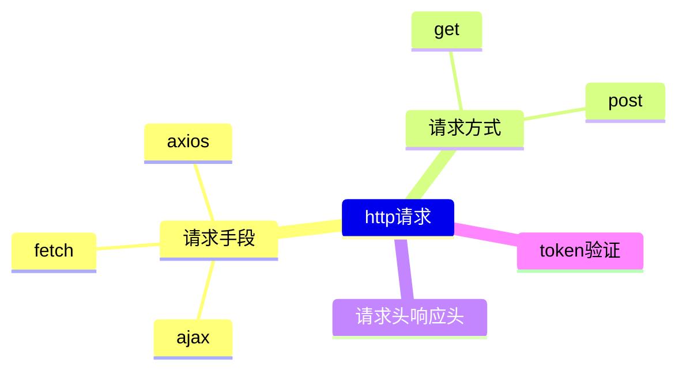

## http

### 导图


### 抽象
#### 请求手段
- axios/fetch/ajax的区别？
  - Ajax: Ajax是基于XMLHttpRequest技术手动封装实现局部刷新数据、异步获取数据的开发方案
    - 缺点：封装复杂、兼容性差等
    - 优点：早期实现局部刷新的方法、异步获取数据
  - fetch：是XMLHttpRequest的一种替代方式，基于原生js实现，完全不兼容IE
    - 缺点：4xx/5xx不会被catch捕获
    - 优点：直接支持stream流，不需要像axios一样设置responseType
    - 为什么需要两个then？
      - 第一个then是对Response的实例进行处理或者异常捕获，第二个then拿到的是真正的数据。
  - axios：axios是基于XMLHttpRequest和Promise封装的第三方库，增加了请求/响应拦截器
    - 优点：拦截器在响应/请求前写入一些逻辑，例如在header中自动加入token、api简单易用、支持操作方式
    - 缺点：第三方库占用空间
#### 请求方式
- 常用的请求方式？
  - GET、POST
- GET和POST请求的区别
  - 安全性不同、传参方式不同、传参大小不同、缓存方式不同
#### 拦截器
```
const service = axios.create({
  baseURL: process.env.VUE_APP_BASE_API, 
  timeout: 15000, // request timeout
  headers: { 'Content-Type': 'application/json;charset=UTF-8' }
})

// 请求拦截器
service.interceptors.request.use(
  (config)=>{
    // do something
    return config
  },
  (error)=>{
    Promise.reject(error);
  }
)

// 响应拦截器
service.interceptors.response.use(
  (response)=>{
    // do something
    return response
  },
  (error)=>{
    Promise.reject(error);
  }
)
```

#### Jwt鉴权
- 什么是JWT鉴权？
  - JWT全称JSON Web Token，是一种用于双方之间传递安全信息的简洁的、URL安全的表述性声明规范。
- JWT实现流程？
  ```mermaid
    flowchart TB
    1[客户端发送用户名和密码]
    2[服务端验证用户名和密码]
      21[生成token]
      22[返回错误信息]
    3[客户端存储token]
    4[客户端发送请求，interceptors请求头携带token到header的Authorization，前缀bearer]
    5[服务端验证token]
      51[返回数据]
      52[返回错误信息或者前端控制重新登录]
    1-->2--验证成功-->21-->3-->4-->5--验证成功-->51
    2--验证失败-->22
    5--验证失败-->52
    5--下一次请求-->4
    5--token过期-->2
  ```
