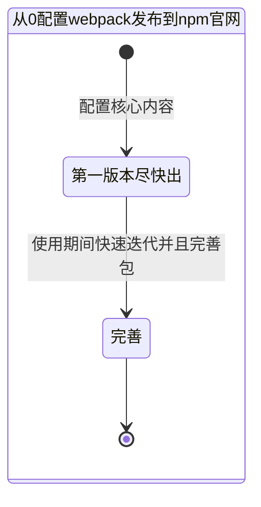
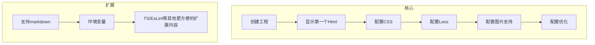
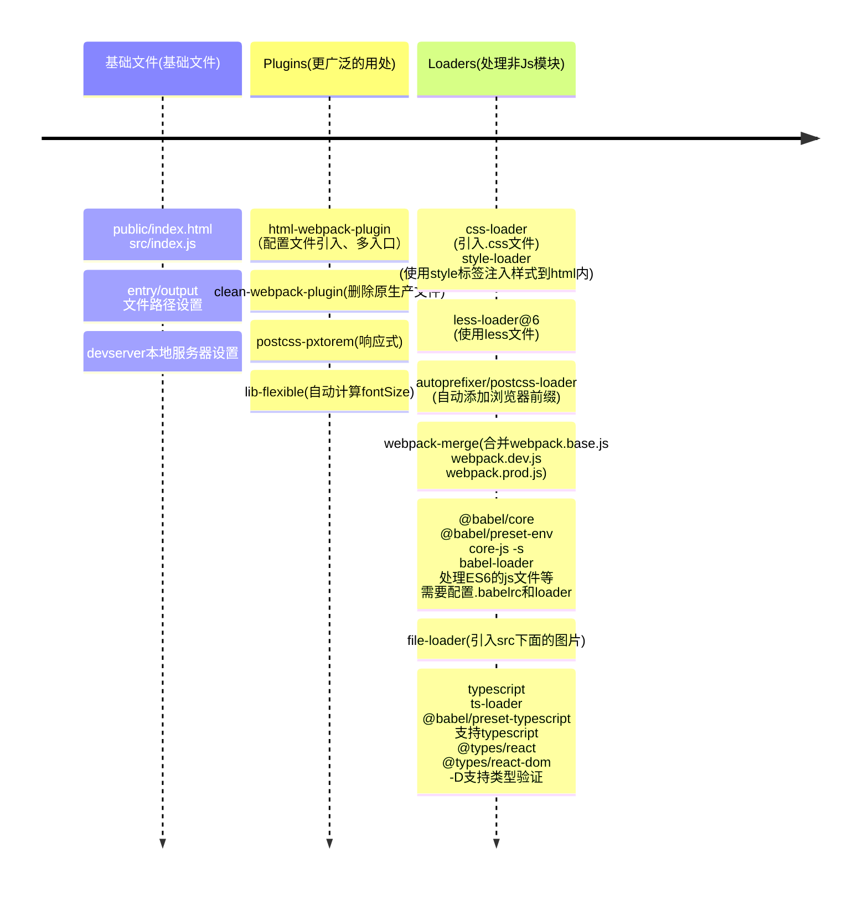
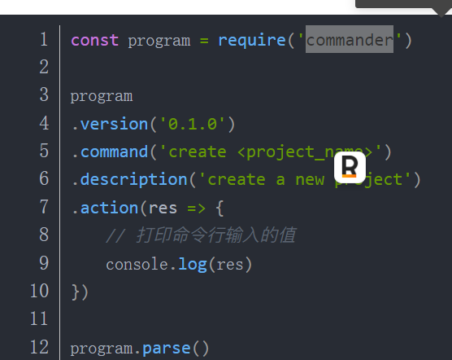
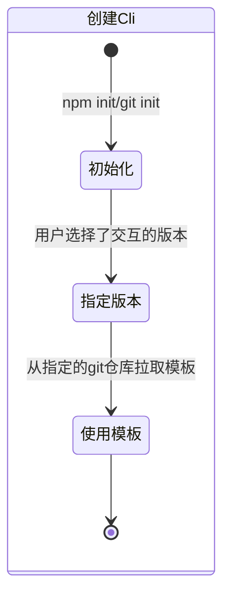
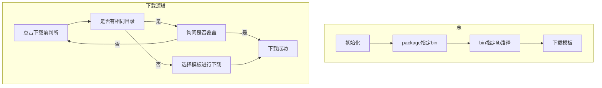

# 从0配置webpack框架
## 前期准备
### MindMap

- 核心包、插件是什么？
- 通用化的方案是什么？
  - 如何支持移动端自动适配？
  - 支持选择移动端和PC端？
  - 环境变量？
  - 如何上传webpack到npm？
- 如何最快速的实现一个版本？
- index.js作用？

### StateDiagram

### Flowchart

### TimeLine

## 自定义Cli

### MindMap

- bin文件夹下是可执行的入口文件灯
- lib下是工具函数等
- npm link测试cli工具是否可以使用
- *#! /usr/bin/env node*
- commander自定义命令
  - 

### StateDiagram

### Flowchart

