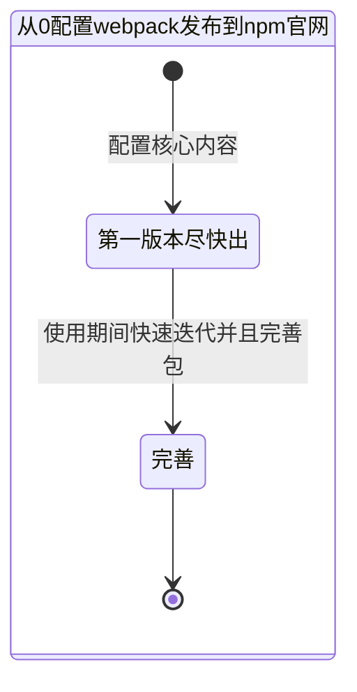
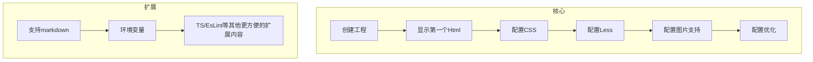
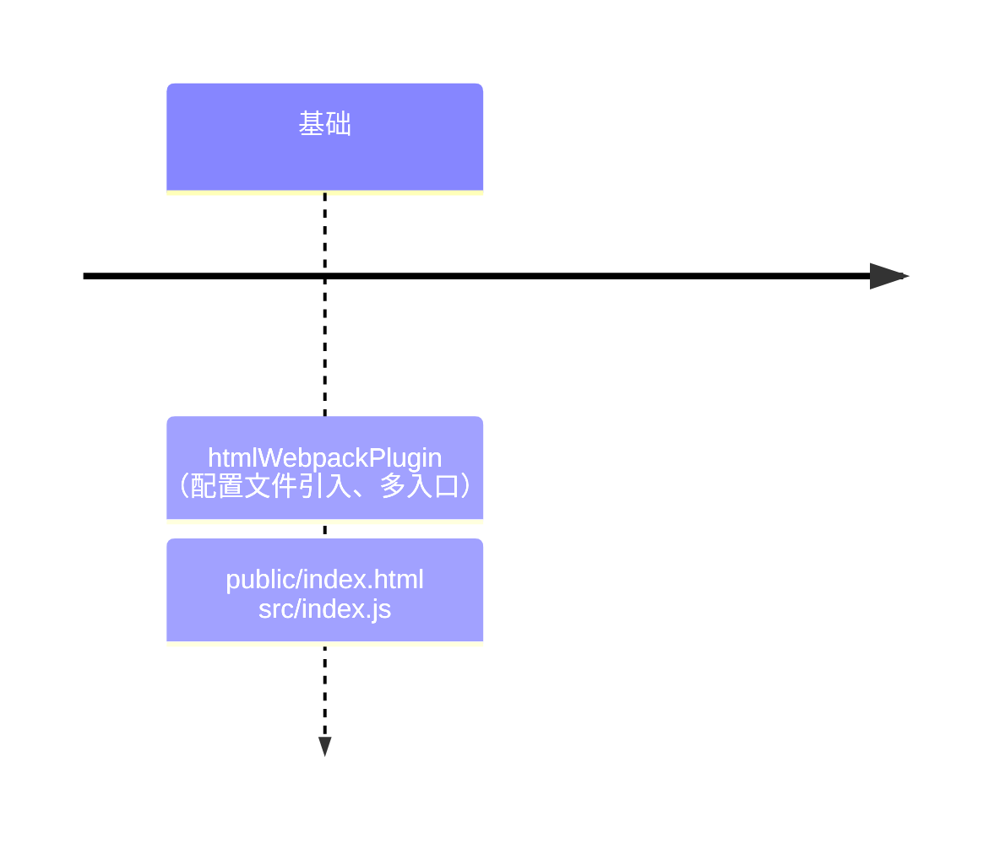

# 从0配置webpack框架
## 前期准备
### MindMap

- 核心包、插件是什么？
- 通用化的方案是什么？
  - 如何支持移动端自动适配？
  - 支持选择移动端和PC端？
  - 环境变量？
  - 如何上传webpack到npm？
- 如何最快速的实现一个版本？
- index.js作用？

### StateDiagram

### Flowchart

### TimeLine

