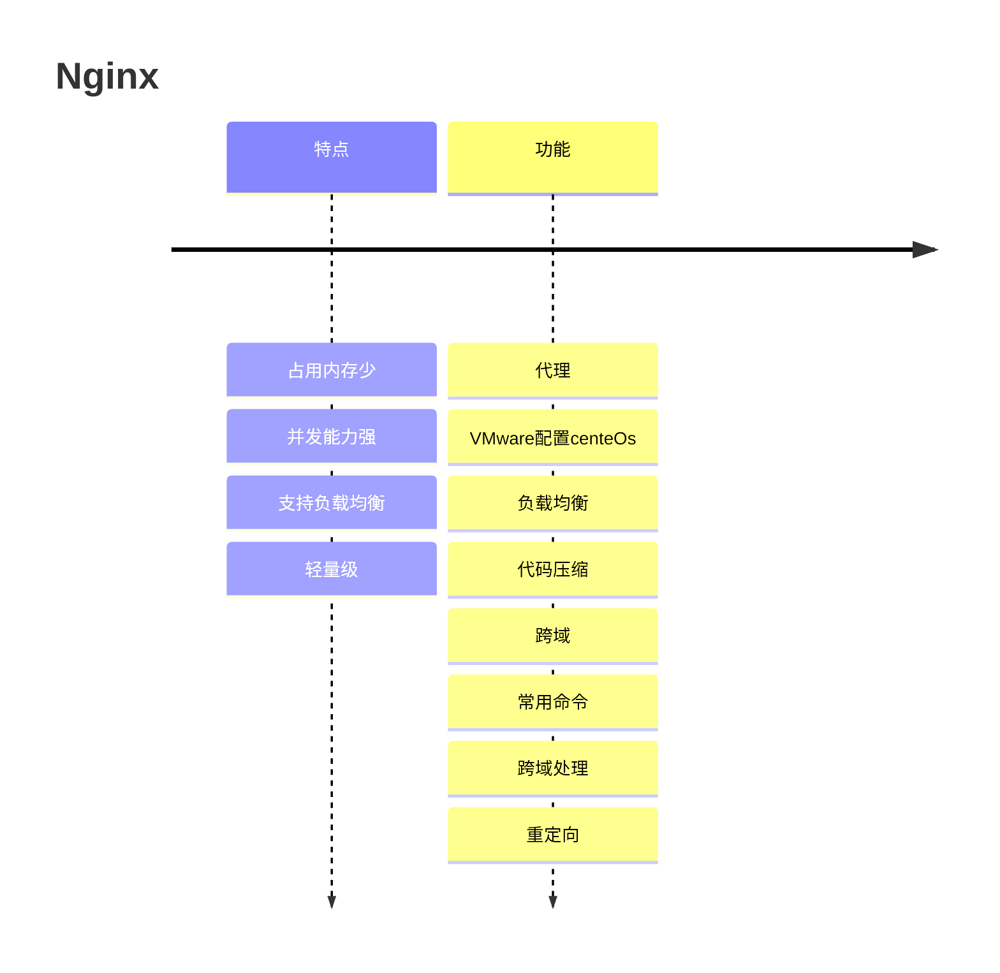
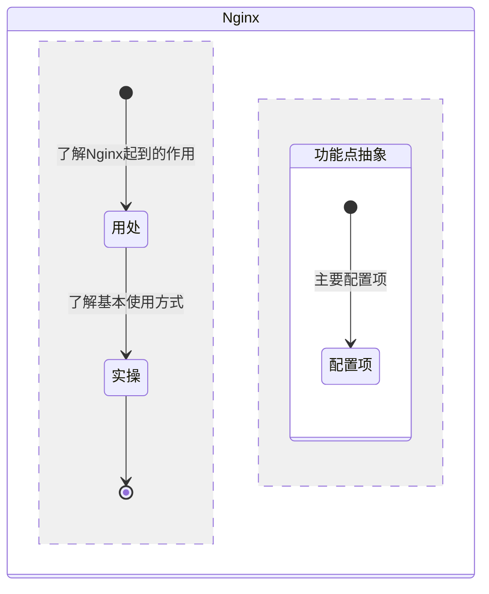

## Nginx

### Map

- 反向代理/正向代理
- 占用内存少，并发能力强
- 命令？
- 负载均衡？
- nginx和gzip关系？
- linux安装
- vmware练习linux
- 跨域配置反向代理


### Timeline



### StateDiagram



### flowchart


### 总结

#### 什么是Nginx？

> Nginx (engine x) 是一个高性能的HTTP和[反向代理](https://so.csdn.net/so/search?q=反向代理&spm=1001.2101.3001.7020)服务器，也是一个IMAP/POP3/SMTP服务器。
>
> 它是一种轻量级的Web服务器，可以作为独立的服务器部署网站（类似Tomcat）。它高性能和低消耗内存的结构受到很多大公司青睐，如淘宝网站架设。

#### 主要适用点？

> [功能](#timeline)

#### Nginx部署

> [VMware安装centOs7](https://blog.csdn.net/feng8403000/article/details/131618368)
> [centOs7安装Nginx](https://segmentfault.com/a/1190000018109309)
> [xshell安装](https://www.jb51.net/softs/753107.html#downintro2)

> [其他-1](https://segmentfault.com/a/1190000018109309)
> [其他-2](https://blog.csdn.net/m0_52985087/article/details/132031312)

#### 卡点
1. 403问题
> [虚拟机设置等](https://blog.csdn.net/h18208975507/article/details/112462463)

2. 常用命令
```shell
#!/bin/bash
 
# 安装库
yum install epel-release -y
 
 
# 安装 Nginx
yum install nginx -y
 
# 启动 Nginx 服务
systemctl start nginx
 
# 关闭防火墙
systemctl stop firewalld
 
# 禁用防火墙
systemctl disable firewalld
 
# 设置 Nginx 开机自启动
sudo systemctl enable nginx
```

3. 端口设置问题

