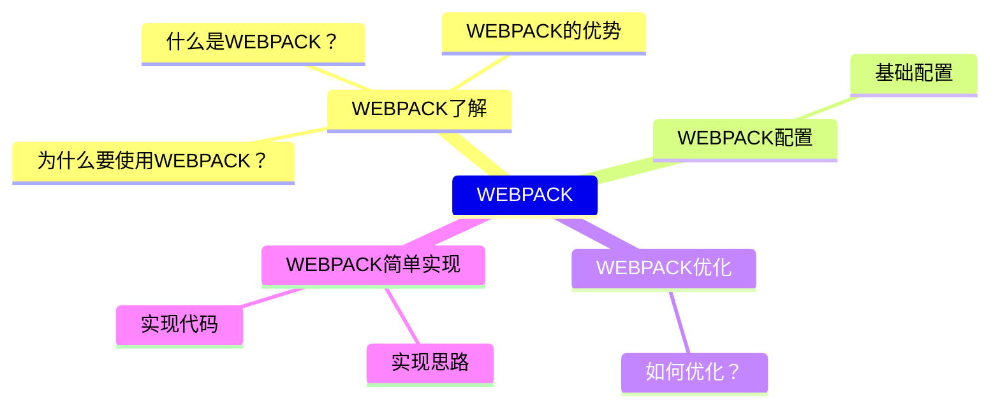
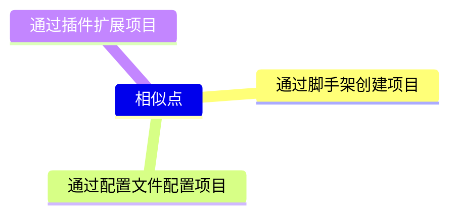
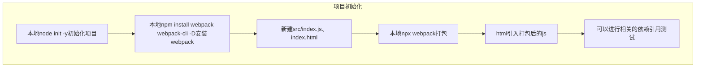
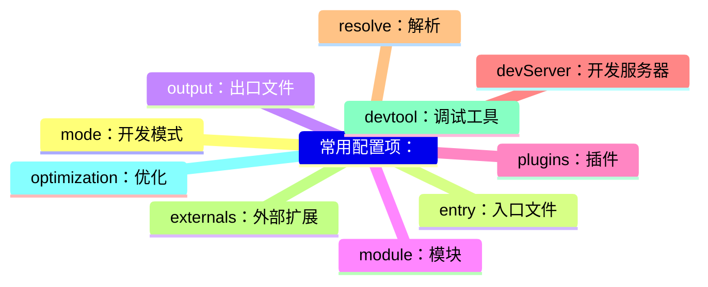
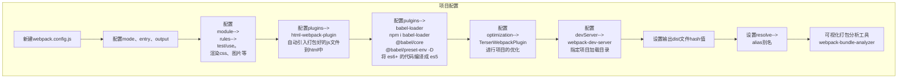

## WEBPACK 基础

### 思维导图

#### 通用化

#### 疑点总结

- 从 0 配置 webpack 从哪里入手？
- 对配置项的概念不清晰

#### 问题总结

- 了解 webpack 的基本概念

  > webpack 是一个基于 nodejs 模块打包工具，他可以将相互依赖的 css/html/js/图片等打包成静态资源文件

  > 优点：压缩并较少代码体积、压缩并较少图片大小、可以通过插件干预打包过程

- 从零开始配置 webpack

- style-loader 和 css-loader 的区别？

  > style-loader：将 css 文件以 style 标签的形式插入到 html 中。

  > css-loader：将 css 的各种导入关系进行解析处理。

- html-webpack-plugin 的作用？

  > 作用：将打包后的 js 文件自动引入到 html、配置多入口、缓存等作用

- babel-loader、@babel/core、@babel/preset-env 各自的作用？
    >  babel-loader：将源代码交给babel编译器。
    >  @babel/core：babel 的核心库，用于将 js 文件进行编译。
    > @babel/preset-env：babel 的预设，用于将 es6+ 的代码编译成 es5。