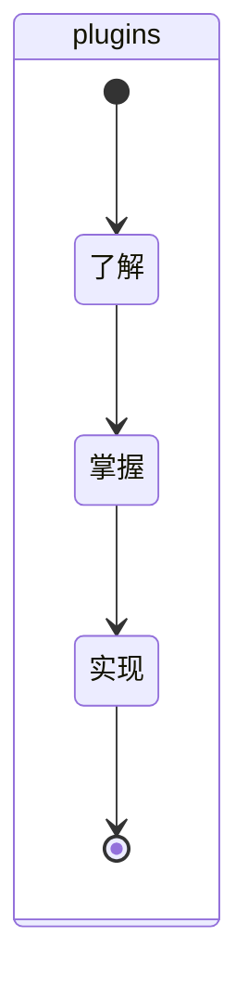

## plugins
### 分解
- plugins的原理是什么？如何设置？
- plugins的应用场景是什么？
- 在webpack中有类似于plugins的设置吗？
- 你在哪里使用过plugins？
- 你对plugins有什么疑问？
- 什么是loader？和plugins的关系是？
- 使用一个loader和plugins并附上地址。

### 抽象

### 总结
- 什么是loader？和plugins的关系是？
  - loader：一般用于特定模块类型进行转换。
    - 比如postcss-loader，用于将css文件进行转换。
  - plugins：用途更加广泛，比如打包优化，资源管理，注入环境变量等。
    - 比如craco-less，可以在不eject的情况下，让create-react-app支持less。
