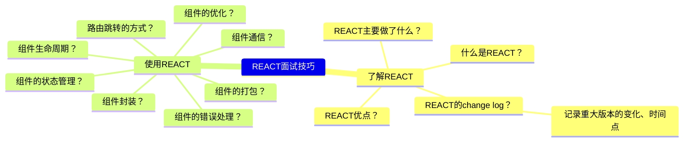
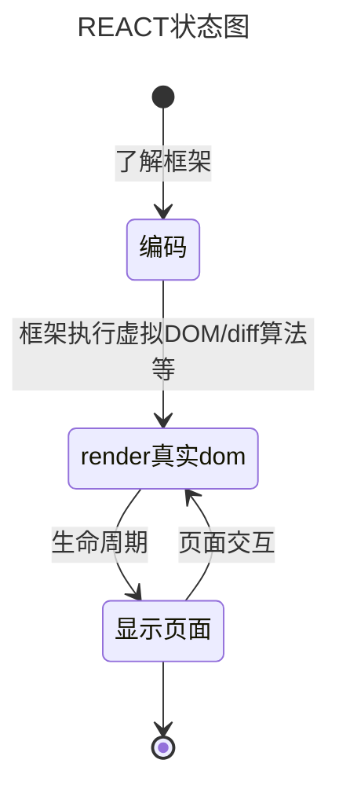
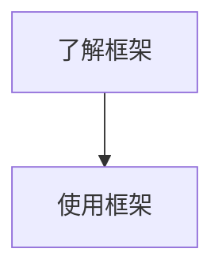
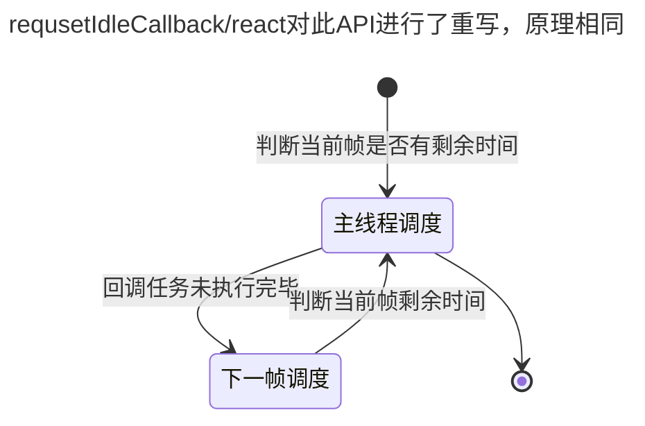
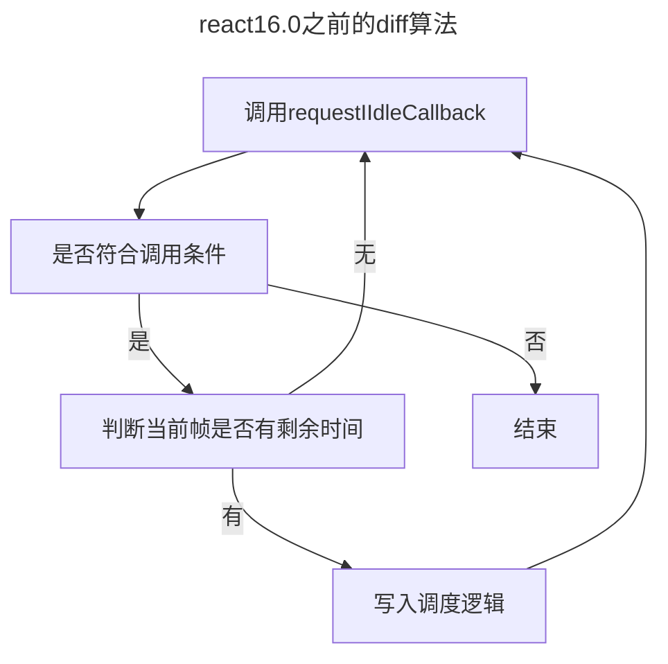

## React 基础

### 思维整理



### 模式


### 抽象



### 总结

#### 总结流程



1. 了解 REACT

   - 什么是 REACT？
     > REACT 是一个用于构建用户界面的 JavaScript 库。  
     > &nbsp;&nbsp;&nbsp;&nbsp;起初是 facebook 为了解决内部开发中遇到的两个问题：大量操作真实 DOM、数据流混乱。  
     > &nbsp;&nbsp;&nbsp;&nbsp;于是，facebook 调研后开发了 react 框架，于 13 年五月开源，国内 16 年开始流行。
   - REACT 优点？
     - 不直接操作真实 DOM 而是操作虚拟 DOM，提高性能
     - 数据流单向，提高代码可读性
     - 组件化开发，提高代码复用性
     - 丰富的生命周期，提供更多的钩子函数
     - 丰富的插件，提供更多的功能
     - diff 算法，更少的操作真实 DOM
   - REACT 重要 change 迭代？

    1. fiber 渲染
        - 虚拟 DOM 的 diff 算法由递归渲染改为 fiber 渲染(React16.0 将树结构改为链表结构)

        - 16.0 以前：深度优先递归渲染，
            > Reconciler通过key值找到变化组件并将真实DOM转为虚拟DOM，diff算法比较虚拟DOM并且打补丁最后使用Renderer渲染真实DOM

        > 一旦开始渲染，就会一直执行到结束

        > 大量组件实例存在时，执行效率变低

        > 用户交互动画效果，出现页面卡顿

        - 16.0 以后：fiber 渲染（整体调度的统称）

            > 增加了Scheduler调度器，也是fiber的核心，当页面变化后会使用Reconciler找到变化后，通过Scheduler调度器在浏览器空闲时间中进行虚拟DOM的可暂停的打标，由effectTag形成effectList，打标以后交由Renderer更新打标的DOM。

        > 利用浏览器空闲时间执行，不会占用主线程。  
        > 浏览器 API：requestIdleCallback：利用浏览器空闲时间执行任务，可以设置优先级。

        > 将 diff 更新 dom 操作碎片化

        > 碎片化任务，可以根据需要中断、继续、重新启动
    2. 生命周期
        > 16.0以前：挂载前后、是否更新、更新前后、卸载
        > 16.0以后: 删除了will系列，会影响vdom链表结构的渲染，保留了shouldComponentUpdate
2. 使用 REACT
   1. 组件优化？
        > 手动优化：shouldComponentUpdate、PureComponent、React.memo
        > 自动优化：React.lazy、React.Suspense

#### 细分流程图





```
requestIdleCallback(myNonEssentialWork, { timeout: 2000 });

function myNonEssentialWork (deadline) {
  // 当回调函数是因为超时才得以执行的话，deadline.didTimeout为true
  while ((deadline.timeRemaining() > 0 || deadline.didTimeout) &&
         tasks.length > 0) {
       doWorkIfNeeded();
    }
  if (tasks.length > 0) {
    requestIdleCallback(myNonEssentialWork);
  }
}
```

```mermaid
---
title: 生命周期
--- 
```
