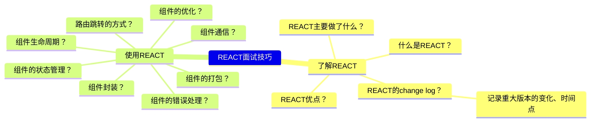
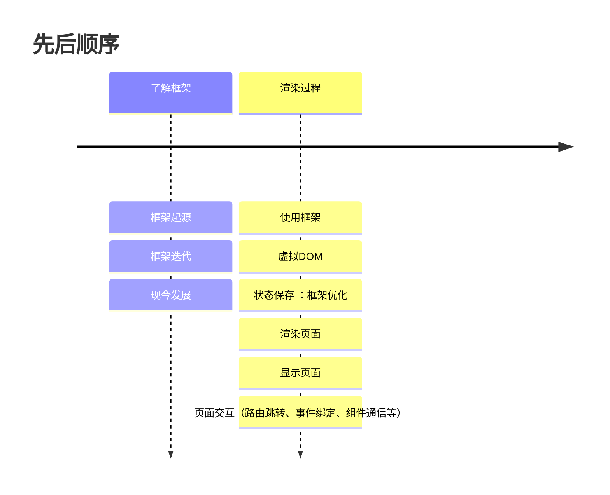
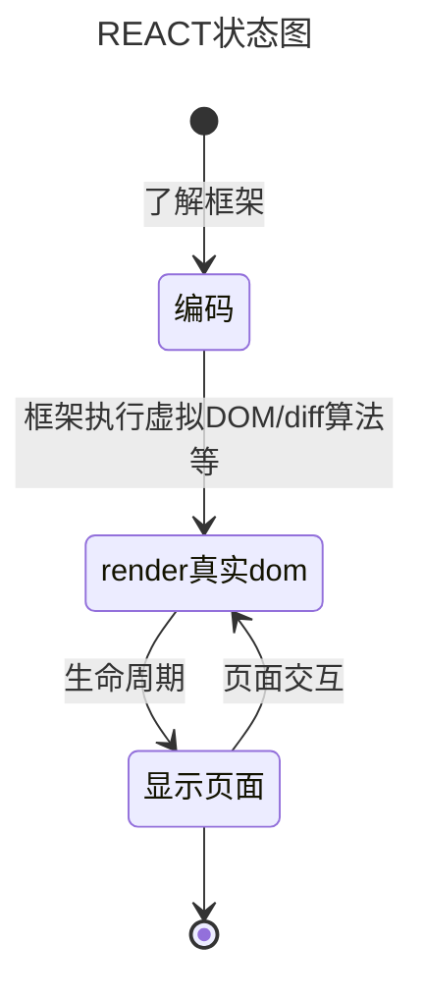

## React 基础

### 思维整理

### 共通点

### 抽象

### 总结
1. 了解REACT
    - 什么是REACT？
        > REACT是一个用于构建用户界面的JavaScript库。  
        > &nbsp;&nbsp;&nbsp;&nbsp;起初是facebook为了解决内部开发中遇到的两个问题：大量操作真实DOM、数据流混乱。  
        > &nbsp;&nbsp;&nbsp;&nbsp;于是，facebook调研后开发了react框架，于13年五月开源，国内16年开始流行。
    - REACT优点？
      - 不直接操作真实DOM而是操作虚拟DOM，提高性能
      - 数据流单向，提高代码可读性
      - 组件化开发，提高代码复用性
      - 丰富的生命周期，提供更多的钩子函数
      - 丰富的插件，提供更多的功能
      - diff算法，更少的操作真实DOM
    - REACT重要change迭代？
2. 使用REACT
