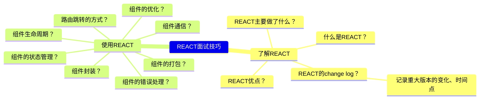
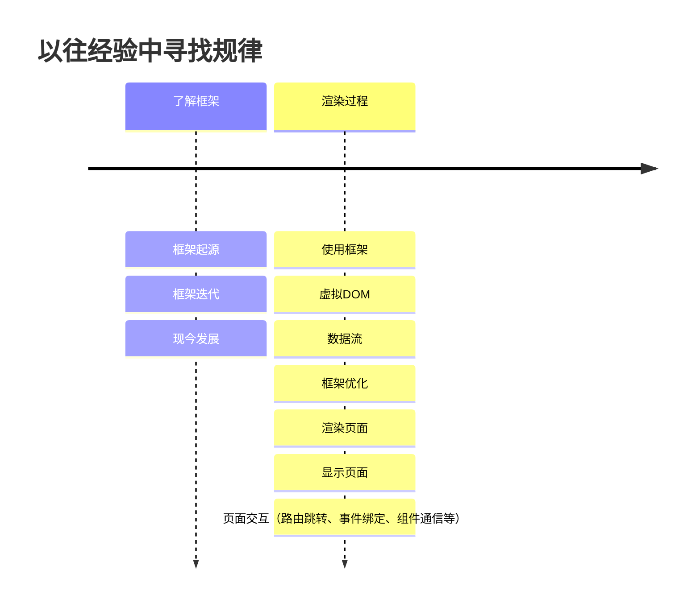
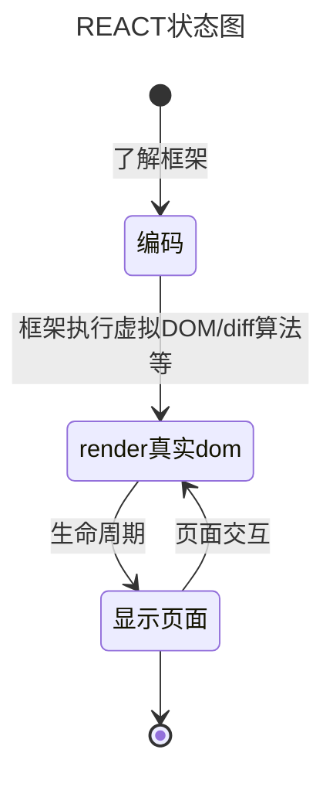
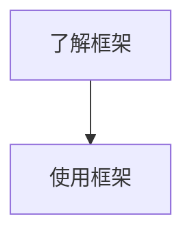
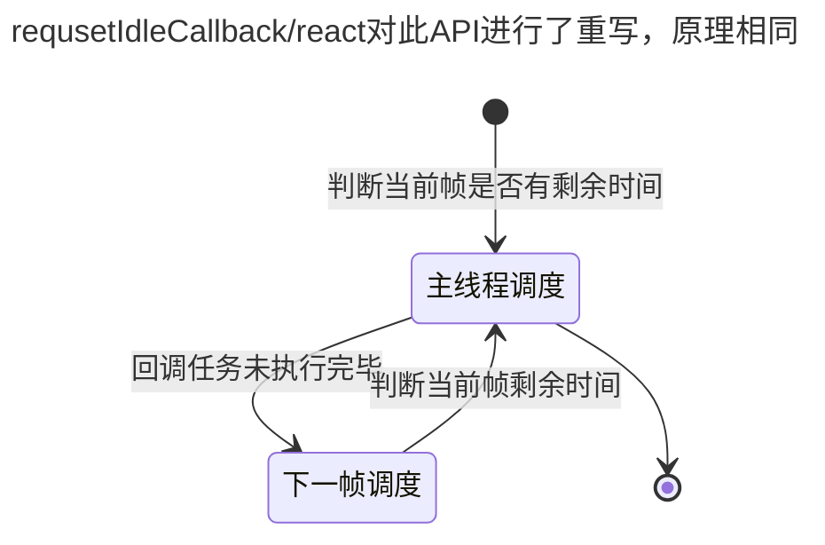
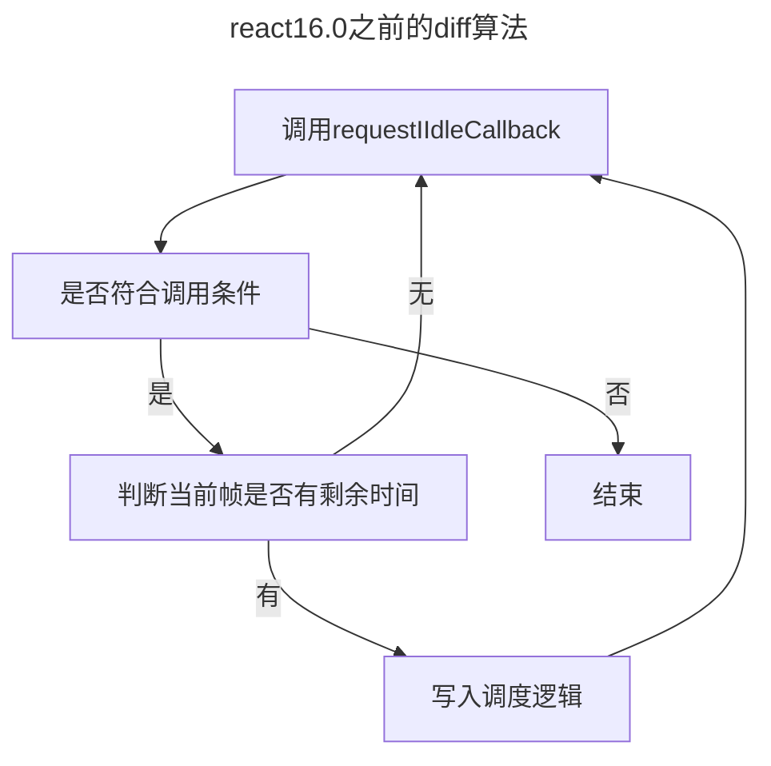

## React 基础

### 思维整理



### 模式



### 抽象



### 总结

#### 总结流程



1.  了解 REACT

    - 什么是 REACT？
      > REACT 是一个用于构建用户界面的 JavaScript 库。  
      > &nbsp;&nbsp;&nbsp;&nbsp;起初是 facebook 为了解决内部开发中遇到的两个问题：大量操作真实 DOM、数据流混乱。  
      > &nbsp;&nbsp;&nbsp;&nbsp;于是，facebook 调研后开发了 react 框架，于 13 年五月开源，国内 16 年开始流行。
    - REACT 优点？
      - 不直接操作真实 DOM 而是操作虚拟 DOM，提高性能
      - 数据流单向，提高代码可读性
        1. flex？
           > 交互  
           > 分发器传递给 store  
           > 订阅 store 的组件，改变 state 到 UI
        2. redux？
           > 单一数据源，所有 state 储存在一个 store 中  
           > state 只读，只能通过 dispatch action 改变
           > action-->reducer-->store-->UI
           > redux 本身不支持异步的 action,redux-saga/thunk 等异步中间件的原理就是判断 action 是否为函数，是就传入 dispatch 和 getState，不是就直接交由 reducer
      - 组件化开发，提高代码复用性
      - 丰富的生命周期，提供更多的钩子函数
      - 丰富的插件，提供更多的功能
      - diff 算法，更少的操作真实 DOM
    - REACT 重要 change 迭代？

     1. fiber 渲染

        - 虚拟 DOM 的 diff 算法由递归渲染改为 fiber 渲染(React16.0 将树结构改为链表结构)

        - 16.0 以前：深度优先递归渲染，

          > Reconciler 通过 key 值找到变化组件并将真实 DOM 转为虚拟 DOM，diff 算法比较虚拟 DOM 并且打补丁最后使用 Renderer 渲染真实 DOM

          > 一旦开始渲染，就会一直执行到结束

          > 大量组件实例存在时，执行效率变低

          > 用户交互动画效果，出现页面卡顿

            > 大量组件实例存在时，执行效率变低

            > 用户交互动画效果，出现页面卡顿

          - 16.0 以后：fiber 渲染（整体调度的统称）

            > 增加了 Scheduler 调度器，也是 fiber 的核心，当页面变化后会使用 Reconciler 找到变化后，通过 Scheduler 调度器在浏览器空闲时间中进行虚拟 DOM 的可暂停的打标，由 effectTag 形成 effectList，打标以后交由 Renderer 更新打标的 DOM。

            > 利用浏览器空闲时间执行，不会占用主线程。

            > 浏览器 API：requestIdleCallback：利用浏览器空闲时间执行任务，可以设置优先级。

            > 将 diff 更新 dom 操作碎片化

            > 碎片化任务，可以根据需要中断、继续、重新启动

      2.  生命周期

          > 16.0 以前：挂载前后、是否更新、更新前后、卸载  
          > 16.0 以后: 删除了 will 系列，会影响 vdom 链表结构的渲染，保留了 shouldComponentUpdate

2.  使用 REACT

    1. 组件优化？

       > 手动优化：shouldComponentUpdate、PureComponent、React.memo  
       > 自动优化：React.lazy、React.Suspense

    2. hooks

       > 解决组件之间的复用状态逻辑很难，需要借用第三方库

       > 解决复杂组件难以理解


       - 为什么 hooks 不能在循环、条件、嵌套函数中使用？

         > hooks 是根据数组的顺序存储 state 的，如果在循环中使用，前置 useState 不调用会导致顺序混乱，无法确定当前的 hooks 是哪一个

       - 为什么函数组件会执行两次？为了定位错误，原话是：根据我们的经验，render两次就可以让人们注意并修复渲染中副作用引起的问题。[issues跳转](https://github.com/facebook/react/issues/17786)

       - useEffect 两种情况:
         1. 传入空数组，只执行一次
         2. 传入数组，数组中的值发生变化，执行一次
       - useLayoutEffect 和 useEffect 的区别？
         > useLayoutEffect 会在浏览器渲染之前执行，useEffect 会在浏览器渲染之后执行，useEffect 为异步，useLayoutEffect 为同步

       - useMemo [demo](https://github.com/liquidGo/Abstract_Key_Processes/blob/master/src/other/useMemo%26useCallback/index.tsx)
         > 传入一个函数和依赖项，返回一个值，当依赖项发生变化时，重新计算值  
         > 比如一个对象，性别不改变，只改变姓名，可以监听姓名这个 state
         > 场景：[未使用useMemo](../images/9cfe3a0b1d81794b76d99659df2be72cda3e1e1a24f4939c821c89f0e496687e.png) [使用useMemo](../images/ce86948d23f6de60f95c7f6799a83f3ea528379b9a44719cb9e333b8b7c9ba41.png)  

       - useCallback  [demo](https://github.com/liquidGo/Abstract_Key_Processes/blob/master/src/other/useMemo%26useCallback/index.tsx)
         > 前提是组件的 props/state 发生改变以后就会渲染整个组件，useCallback 就可以针对子组件的 reRender 进行优化，只有当依赖项发生改变时，才会重新渲染子组件，父组件中不相关的 state 发生变化也不会重新分配函数地址，配合 memo 使用。
         > 只有在父组件传给子组件的函数相关的变量发生改变的时候，才会去重新分配函数地址，否则不会重新分配函数地址。

       - useRef
         > class 组件可以获取到子组件的实例，函数组件没有实例需要使用 useRef 进行实例的一个挂载。

       - useReducer
         > 对复杂的 state 进行管理，聚合 state 通过 reducer 函数+dispatch 进行改变状态

       - useContext
         > 通过顶层组件向下传递的方式，可以在任意子组件中获取到顶层组件的上下文，一般用于移动端等小型的项目中
         > 可以配合 useReducer 作为一个小型的 redux 使用。

       - use 自定义 HOOK
         > 通过 use 开头的函数，可以自定义一个 HOOK，可以将一些逻辑进行封装，方便复用
         > 通过闭包进行实现，返回指定的值，可以在自定义hook中写入useEffect等钩子函数

#### 细分流程图





```
requestIdleCallback(myNonEssentialWork, { timeout: 2000 });

function myNonEssentialWork (deadline) {
  // 当回调函数是因为超时才得以执行的话，deadline.didTimeout为true
  while ((deadline.timeRemaining() > 0 || deadline.didTimeout) &&
         tasks.length > 0) {
       doWorkIfNeeded();
    }
  if (tasks.length > 0) {
    requestIdleCallback(myNonEssentialWork);
  }
}
```
