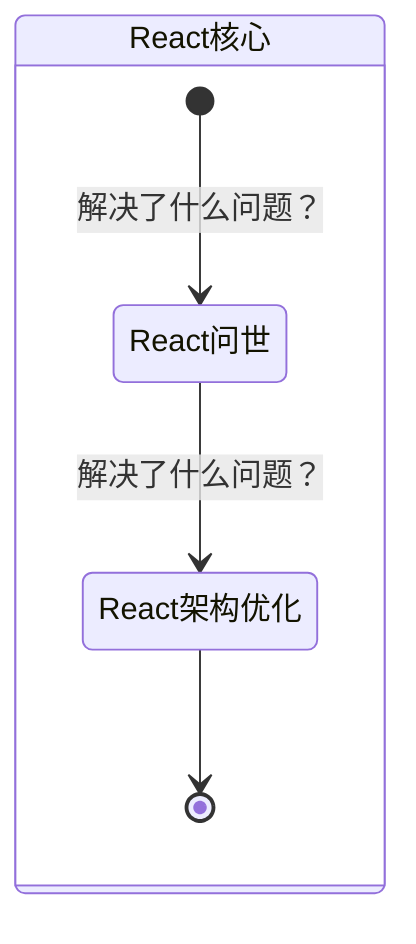
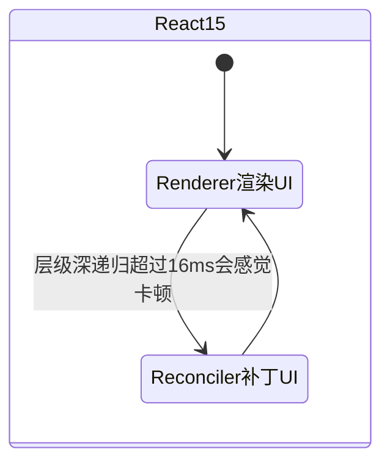

# React Change Log

## 理解React/成为React

### MindMap

- React解决什么问题？
- React的核心原理是什么？核心实现是什么？
- Scheduler：调度器：调度器主要负责优先级调度，高优先级的任务优先进入 Reconciler

### StateDiagram

## React15

### MindMap

- Reconciler：协调器：负责计算UI的变化并且补丁到页面上
- Renderer：渲染器：把UI渲染到宿主上
- 引入了 `dangerouslySetInnerHTML` 属性来插入原始 HTML。

### StateDiagram

## React16

### MindMap

- Scheduler：新增调度器，高优任务先进入Reconciler渲染
- fiber架构：引入fiber架构作为VDOM的实现，新架构的基石；由于是链表的结构，可中断，可继续执行任务而不会像React15版本的递归一样，如果暂停了就会出现渲染一般的情况。
- 双缓存机制：current fiber当前渲染树、workInProgress fiber由diff算法比对current fiber和vdom生成，最后替换掉current fiber树实现双缓存机制。
- [错误边界](./[⭐⭐⭐⭐]-错误边界.md)

## React16.8

### MindMap

- 新增了Hooks函数式组件，为了解决类组件的心智负担、业务逻辑混乱、状态复用等因素。

## React17（垫脚石版本）

### MindMap

- 主要做了一些内部的优化：
  - 将事件注册在根节点
  - 编写JSX代码不必再导入react包

## React18

### MindMap

- setState自动批处理