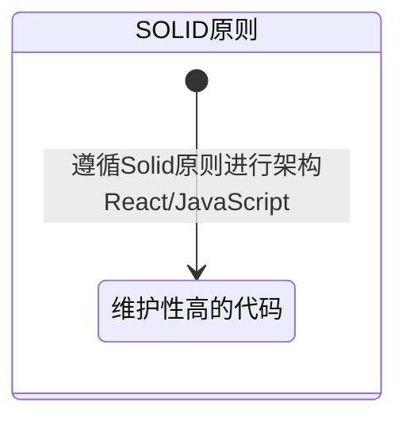

# 设计模式

## Solid设计模式基础

### MindMap

- 什么是Solid？
- Solid的核心是什么？如何跟React相结合？
- 高内聚低耦合是Solid原则吗？
- JavaScript中的Solid原则？
- 如何最简单的遵循Solid原则？

### StateDiagram

### Flowchart

#### React useful Solid

> Solid的面向对象中的基础设计原则，遵循Solid设计模式可以大大增加代码的可维护性、整洁性。[文档1](https://blog.csdn.net/BWater_monster/article/details/128167274) [文档2](https://developer.aliyun.com/article/1411268#slide-4) [React设计模式](https://github.dev/kentcdodds/advanced-react-patterns)

- **单一职责原则**（Single...）：每一个类、组件、函数只做一件事情。
  - 将功能较多的大型组件拆分为较小的组件；
  - 将与组件功能无关的代码提取到单独的函数中；
  - 将有联系的功能提取到自定义 Hooks 中（同时使用了useEffect和useState就可以考虑封装Single的useHook）

- **开闭原则**（Open...）：软件的实体应该是可扩展而非可修改的。
  - React设计模式**Render Props**就是遵循开闭原则，通过外部传入的React.ReactNode来进行扩展组件的功能。
  - React设计模式**Comonent Componds**也是遵循开闭原则，不改变原导出组件，只新增组件挂载在父类上导出。

- **里氏替换原则**（Liskov...）：子类的实例可以替代父类的实例（子类实现可以实现父类的方法但是不能修改父类方法的行为）
  - 封装原生组件，封装后的组件也必须能接收原生组件的属性。
- **接口分离原则**（Interface...）：不需要依赖他不使用的接口。
  - 组件不应该依赖它用不到的PropsInterface
- **依赖倒转原则**（Dependency...）：依赖抽象而不是具体实现
  - React设计模式**Render Props**遵循依赖倒转模式，对外暴露指定逻辑。
  - React设计模式**Prop Collections and Getters**完全遵循依赖倒转模式，对外提供Collections集合和Getters接收外侧函数。
  - React设计模式**Conrol Props**遵循依赖倒转模式，可基于外部抽象的状态。