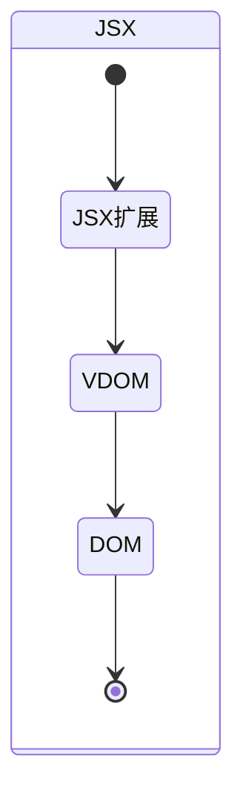

## JSX相关

### MindMap

- 什么是JSX？
- JS能直接读取JSX吗？
- 如果不能的话，做了怎样的处理才可以的？

### StateDiagram

### Flowchart

- 什么是JSX？

  > JSX是JavaScript的语法的扩展，需要通过babel-preset-react转换为普通的Js代码（虚拟Dom）

  

- Js能直接读取JSX吗？

  - Js不能直接读取JSX，需要通过Babel转义成Js才可以读取，如果不能配置babel-preset-react进行转义的话，就需要使用React.createElement手动写入虚拟DOM

