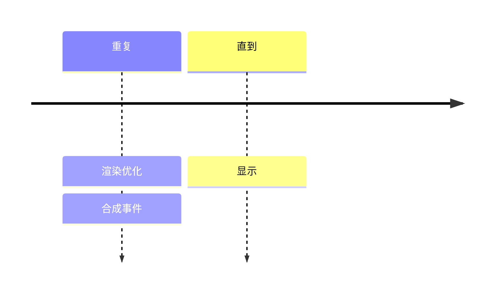
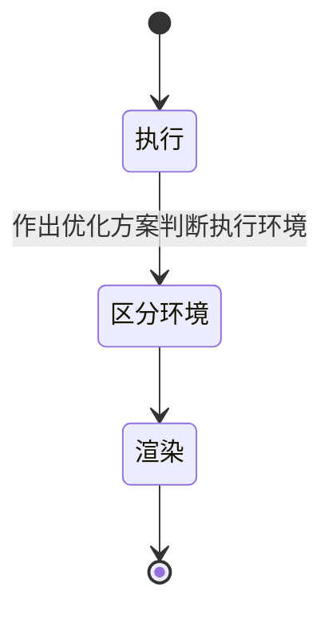
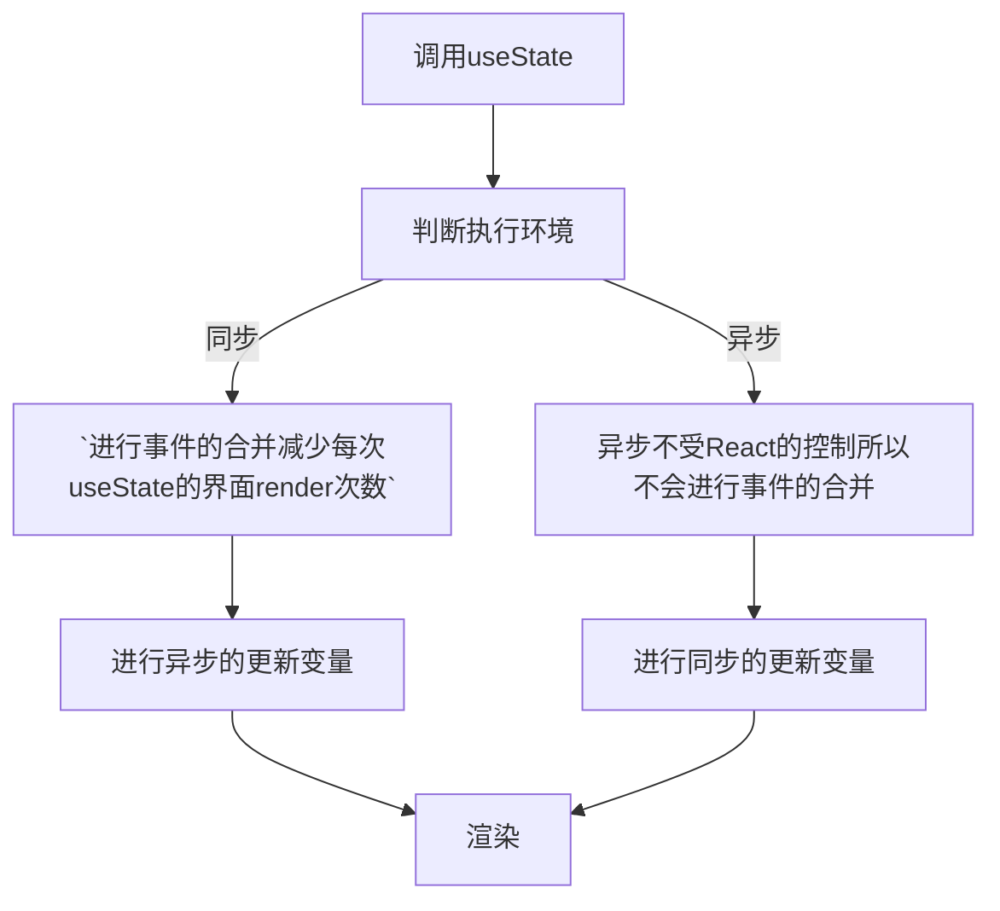

## useState是同步还是异步
### 灵感
- 什么是同步异步？
- v18版本以后的useState发生变化。
- v18以前的版本，同步或者异步取决于他的调用环境。
  - 同步环境执行useState会打印最后一次的输出
  - 异步环境执行useState会打印最后的输出
  - 为什么同步执行和异步执行会不同
  - 什么是合成事件？什么是原生事件？
  - 什么是react的事务机制？

### 模式识别

### 提炼

### 流程

- 什么是同步异步？
  - [了解异步](../03_JS/[⭐⭐⭐⭐⭐]-异步.md#了解异步)
- v18版本中无论useState在哪里执行都是异步的。
- 什么是冒泡和捕获事件？
- 什么是react合成事件和原生事件？
  - 原生事件：原生事件就是js的原生事件，如通过document.addEventListener来设置的监听事件。
  - 合成事件：React有自己的一套机制，重新封装了大部分的原生事件。合成事件采用了事件池，大大的节省内存，而不会频繁的销毁对象和创建对象。