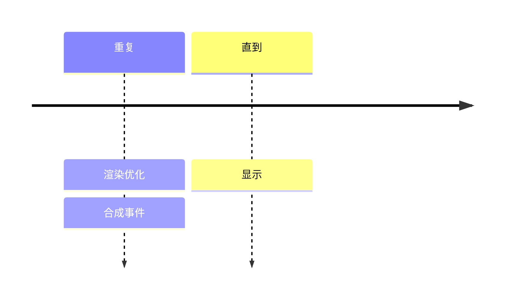
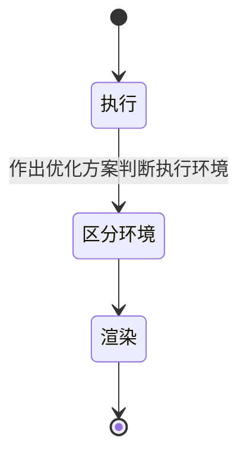
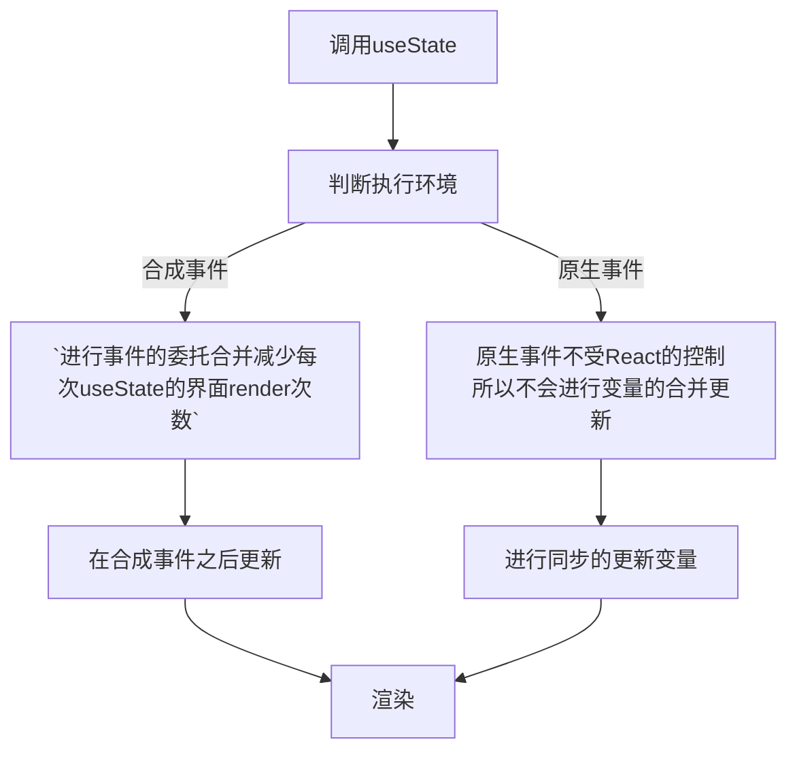

## useState是同步还是异步
### 灵感
- 什么是同步异步？
- v18版本以后的useState发生变化。
- v18以前的版本，同步或者异步取决于他的调用环境。
  - 同步环境执行useState会打印最后一次的输出
  - 异步环境执行useState会打印最后的输出
  - 为什么同步执行和异步执行会不同
  - 什么是合成事件？什么是原生事件？
  - 什么是react的事务机制？

### 模式识别

### 提炼

### 流程

- 什么是同步异步？
  - [了解异步](../03_JS/ECMAScript/[⭐⭐⭐⭐⭐]-ECMAScript-Promise.md#了解异步)
- v18版本中无论useState在哪里执行都是异步的。
- v18版本之前
  - 这里的“异步”并不是说内部由异步代码实现，其实本身执行的过程和代码都是同步的，只是合成事件和钩子函数的调用顺序在更新之前，导致在合成事件和钩子函数中没法立马拿到更新后的值，形式了所谓的“异步”。
- 什么是冒泡和捕获事件？
  - 冒泡事件：微软公司提出的，事件由子元素传递到父元素的过程叫做冒泡（false）。
  - 捕获事件：网景公司提出的，事件由父元素传递到子元素的过程叫做事件捕获（ture）。
  - [详解](https://blog.csdn.net/u013194063/article/details/130284649)
- 什么是事件委托？
  - 事件委托就是利用事件冒泡，只指定一个事件处理程序，就可以管理某一类型的所有事件。
  - 好处：可以大大减少内存消耗，减少事件注册，提高性能。
  - 有两个属性：target和currentTarget
    - target：事件源，触发事件的元素。触发事件的元素
    - currentTarget：事件处理程序所绑定的元素。顶层元素
  - [详情](http://movies.itheima.com/news/20211029/133654.html)
- 什么是react合成事件和原生事件？
  - 原生事件：原生事件就是js的原生事件，如通过document.addEventListener来设置的监听事件。
  - 合成事件：React有自己的一套机制，重新封装了大部分的原生事件。合成事件采用了事件池，大大的节省内存，而不会频繁的销毁对象和创建对象。