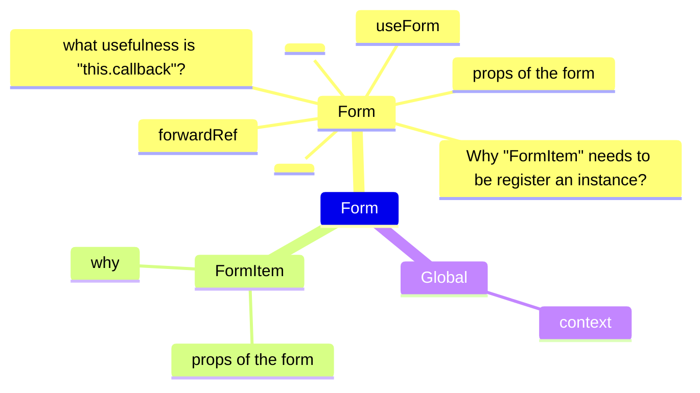
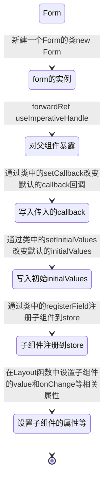
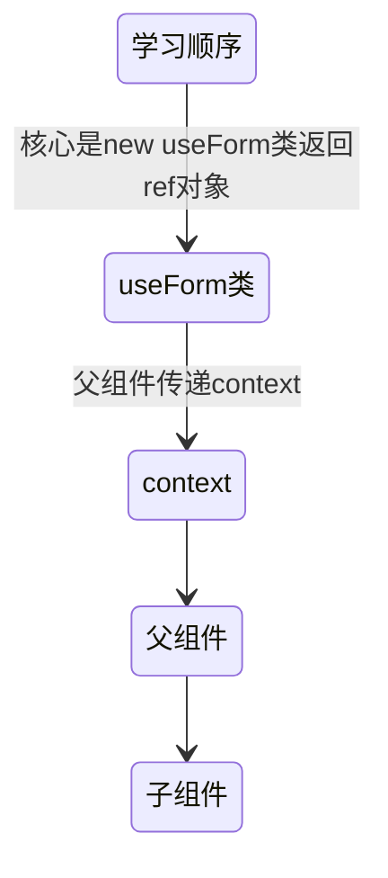
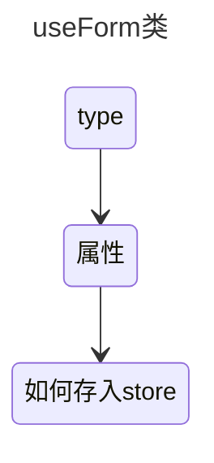

## Form组件

> 开源仓库来自：[京东组件库](https://nutui.jd.com/h5/react/2x/#/zh-CN/component/form)
### Form的组成

```mermaid
---
title: 组成部分
---
mindmap
Form
    Form
        forwardRef
        useForm
        <Cell/>
        <Context.Provider>
        props of the form
        what usefulness is "this.callback"?
        Why "FormItem" needs to be register an instance?
    FormItem
        props of the form
        why 
    Global
        context
```

### 主流程抽象

```mermaid
stateDiagram-v2
Form-->form的实例: 新建一个Form的类new Form
form的实例-->对父组件暴露: forwardRef useImperativeHandle
对父组件暴露-->写入传入的callback: 通过类中的setCallback改变默认的callback回调
写入传入的callback-->写入初始initialValues: 通过类中的setInitialValues改变默认的initialValues
写入初始initialValues-->子组件注册到store: 通过类中的registerField注册子组件到store
子组件注册到store-->设置子组件的属性等: 在Layout函数中设置子组件的value和onChange等相关属性
设置子组件的属性等-->[*]
```

```mermaid
stateDiagram-v2
学习顺序-->useForm类: 核心是new useForm类返回ref对象
useForm类-->context: 父组件传递context 
context-->父组件
父组件-->子组件
```

```mermaid
---
title: useForm类
---
stateDiagram-v2
type-->属性
属性-->如何存入store
```

