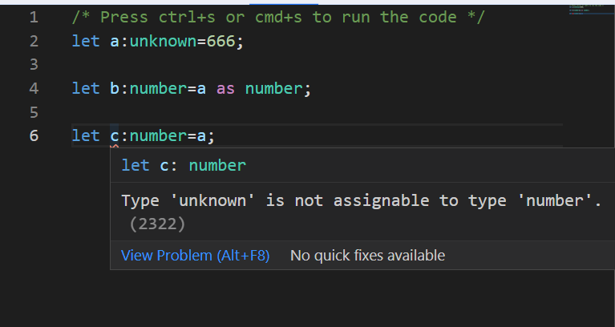

### unknown和any的区别

#### 问题
- 两者的作用是什么？
- 两者的区别是什么？
- 两者的使用场景分别是什么？
- 简单案例？

#### 总结
- 两者的作用是什么？
  - unknown: 未知类型，可以赋值给任何类型，但是不能赋值给unknown以外的类型
  - any: 任意类型，可以赋值给任何类型，也可以赋值给any以外的类型
  
- 两者的区别是什么？
  - unknown：比any更加严格，unknown类型的变量不能直接赋值给其他类型的变量，需要先判断类型，再赋值
  - any：比unknown更加宽松，any类型的变量可以直接赋值给其他类型的变量

- 两者的使用场景是什么？
  - unknown：一般用于类型不明确的情况，比如从第三方库中获取数据，但是不确定数据的类型
  - any：一般用于类型明确的情况，比如从第三方库中获取数据，确定数据的类型

- 简单案例？
  >   
