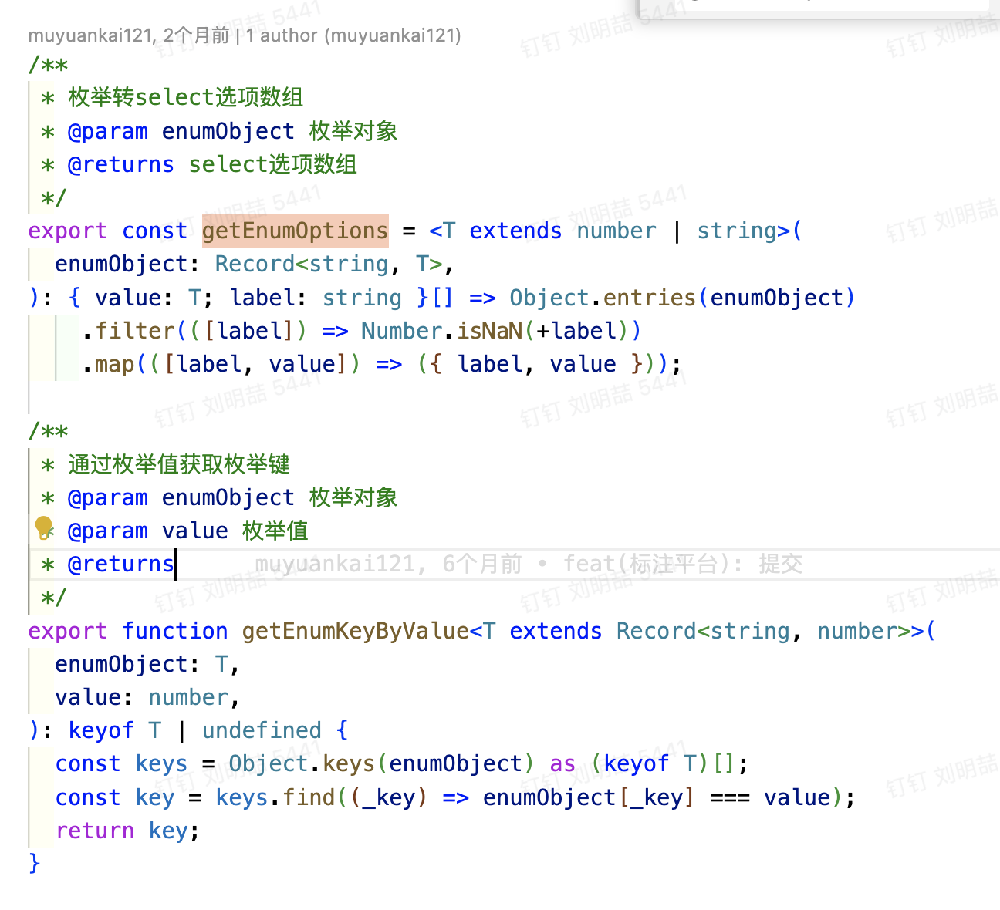

### enum

#### 问题
- enum作用？
- 和object映射的区别？优点？
- 如何使用？
- 使用场景？
- 如何命名？

#### 总结
- enum作用？
  > 用于定义一组常量，常用于状态码、类型码等

- 和object映射的区别？优点？
  > object映射的是一组属性，enum映射的是一组常量，enum更加简洁并且只可读不能修改。

- 如何使用enum?
  >   

- 使用场景？
  > 通过枚举直接转Select数组等。