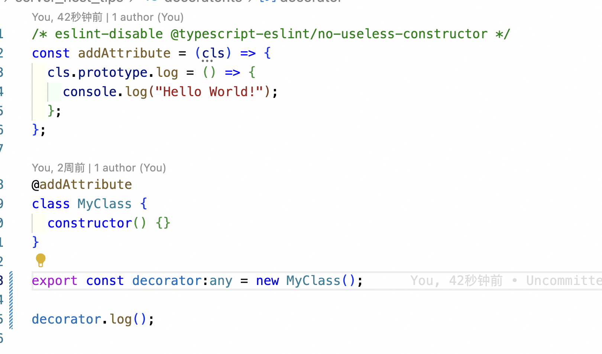

## 什么是装饰器

### 灵感
- 什么是装饰器？
- 装饰器的作用是什么？
- 装饰器的原理是什么？
- 哪些常见的装饰器？

### 总结
- 什么是装饰器？装饰器的作用是什么？
  > 装饰类的函数，可以在不改变原有类的情况下，增加新的功能。
   

- 常见的装饰器？
  > @Getter：写入getter和setter方法 [调用](../../images/d8c3bcea1e04d9fbd57d249e566c3b5a70b9f608d5db12c28df053402e3af798.png)  [写入](../../images/fd970bf57e7f7d6c511f509a62c583954d1733d3a44da95c1a5f11d325f6f933.png)  

  > @RestController
  > @Override
