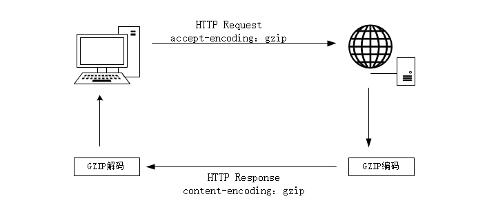

# 性能优化

## Http缓存

- [详情](https://blog.csdn.net/zz_jesse/article/details/123304077)

## CSS

## HTML

## Gzip压缩

### 什么是Gzip压缩

1. 浏览器请求url，并在请求头中设置属性accept-encoding: gzip。这表明该浏览器是支持gzip，该参数浏览器在请求资源时会自动带上。

2. 服务器在接收到浏览器发送的请求之后，服务器会返回压缩后的文件，并在响应头重包含content-encoding: gzip。若是没有gzip文件，会返回为压缩的文件。

3. 浏览器接收到服务器的响应之后，根据content-encoding: gzip响应头使用gzip策略解压压缩后的资源，通过content-type内容类型决定怎么编码读取该文件内容。

[百度知道](https://zhidao.baidu.com/question/1616312391774835307.html)

## Webpack

## Nginx

- [正向代理/反向代理](https://blog.csdn.net/lizhengyu891231/article/details/98024695)：代理客户端/代理服务器（服务端做一些跨域、负载均衡等操作）
- [性能优化](https://blog.csdn.net/Bcoovo/article/details/130156936)

