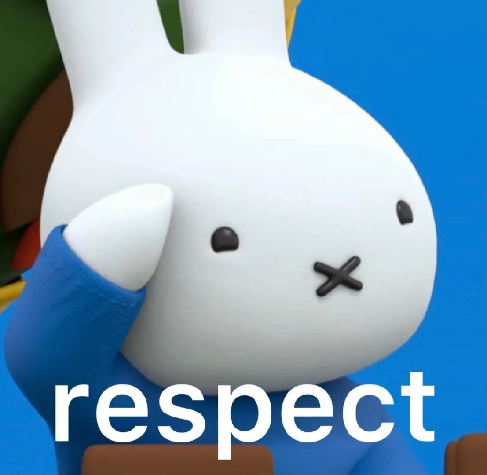

## 系统整理前端之路
从一个IT小白成长为老白的过程中，你会慢慢的发现最重要的不过就是**基础**而已，出来混的，始终是要还的。  
  
<u>这是一个由浅入深的系统性整理，主要以基础展开到源码分析、组件封装的博客。</u>

**每一个分类都会从⭐-⭐⭐⭐⭐⭐进行分类，如果正在准备面试，你可以尝试从最重要的部分下手**

Send questions to [WeChat](./IMG.md#wechat-img)。  
